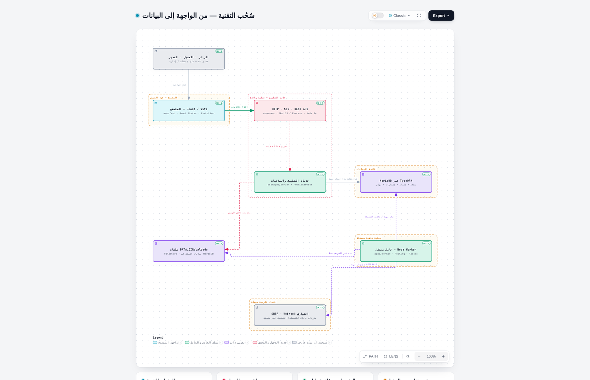
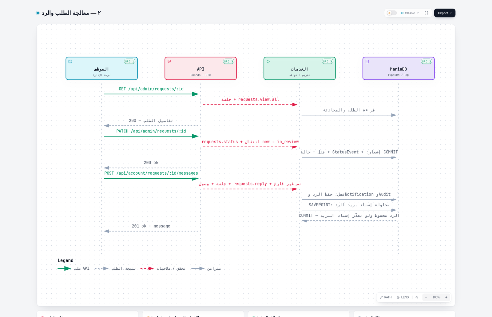

# سُحُب — web

Independent migration of [so7ob/Website](https://github.com/so7ob/Website), preserving its identity, functionality, permissions, content and links.

Original import baseline: `5321b7fd11db421c83290b262f276811e5f04e5f`. Current pinned comparison: `dddf8cd00a19cf7d562f503549f4c000109057d1`.
Architecture reference only: [so7ob/Rakim](https://github.com/so7ob/Rakim) at `cae0950bac45d97971bd3766c8c34f9869a856af`.

حالة المشروع: اكتمل قبول نقل الكود والوظائف ضمن النطاق المثبت في [تقرير القبول النهائي](docs/migration/final-code-parity.md) و[PR #37](https://github.com/so7ob/web/pull/37). الوثائق السابقة تصف مراحل تاريخية. هذا قبول للكود والوظائف، ولا يثبت نشرًا أو ترحيل بيانات إنتاج أو جاهزية تشغيلية. الاستعادة خارج المضيف مؤجلة لعدم توفر بيئة مستقلة.

Independent React/NestJS implementation. Code and functional migration acceptance is documented against the pinned source; production deployment, data migration and operational cutover remain outside that acceptance.

## اكتشف النظام · Explore

| المجال | الوظائف |
|---|---|
| الموقع العام | صفحات عربية/إنجليزية، محتوى منشور، طلبات خدمات واستفسارات |
| حساب العميل | الطلبات والمحادثات والملفات والإشعارات والملف الشخصي |
| الإدارة | إدارة المستخدمين والأدوار والطلبات والمحتوى ومحرر الصفحات |
| المهام الخلفية | بريد دائم، Webhooks مشروطة بالإعداد، تنظيف الملفات والنشر المجدول |

## البنية البرمجية · Architecture



[شرح البنية والأدلة ومسار طلب الخدمة](docs/migration/architecture-explained-2026-10-09.ar.md) · [المخطط التفاعلي](.archify/architecture-so7ob-20261009-230021/so7ob.html)

| المسار | المسؤولية والتقنية |
|---|---|
| `apps/web` | React + Vite + React Router، إخراج المتصفح وSSR |
| `apps/api` | NestJS + Express، HTTP/REST والتحقق من الجلسات والصلاحيات |
| `apps/worker` | عامل Node مستقل لتنفيذ المهام الخلفية |
| `packages/contracts` | عقود البيانات والتحقق المشتركة؛ ليست كيانات قاعدة البيانات |
| `packages/server` | منطق الأعمال والتخزين عبر TypeORM/mysql2 إلى MariaDB |
| `reference/` | أرشيف تاريخي منفصل عن تشغيل المنتج |

المتصفح يطلب API؛ الخادم يراجع الهوية والصلاحيات ويقرأ أو يكتب البيانات. تُحفظ مهام البريد وWebhook والتنظيف في MariaDB ويستهلكها العامل بالاستطلاع والأقفال والإيجار؛ لا يوجد وسيط Kafka أو Redis مفترض في هذا المخطط. الملفات الخاصة تُخدم بعد التحقق من الوصول.

## معرض المخططات · Diagram gallery



| المخطط | النطاق |
|---|---|
| [إنشاء الطلب](.archify/sequence-so7ob-request-20261009-230021/creation/creation.html) | التحقق والحفظ وإسناد المهام |
| [المعالجة والرد](.archify/sequence-so7ob-request-20261009-230021/processing/processing.html) | الصلاحيات والحالة والرد |
| [متابعة العميل والعامل](.archify/sequence-so7ob-request-20261009-230021/followup/followup.html) | القراءة والإشعار والتنفيذ الخلفي |
| [Agent tool-call workflow](.archify/workflow-agent-tool-loop-20261009-231121/agent-tool-loop.html) | مثال توضيحي من Archify؛ ليس تنفيذًا في سُحُب |
| [Agent Run lifecycle](.archify/lifecycle-agent-run-20261009-231544/agent-run.html) | مثال توضيحي؛ التقدم والانتظار وإعادة المحاولة والنهايات |

نزّل ملف HTML وافتحه في متصفح للاستكشاف؛ GitHub يعرض مصدر HTML ولا يشغّله. [فهرس المخرجات وإيصالات التحقق](.archify/README.md) يميز النسخ النهائية من محاولات الإنشاء السابقة. لقطات المعرض من المخرجات نفسها، وليست صورًا لواجهة المنتج. للمخططات قيود إتاحة موثقة في التقارير؛ اجتياز فحوص Archify لا يعني اجتياز axe.

## مهارات التطوير · Skills

توجد المهارات المحلية في [`.agents/skills`](.agents/skills)، ومنها [Archify](.agents/skills/archify/SKILL.md) لتوليد مخططات HTML من مواصفات JSON. حزمة Archify مثبتة بالمصدر والبصمة في [skills-lock.json](skills-lock.json)، مع رخصتها وإشعارات الأطراف الثالثة؛ ليست اعتمادًا لتشغيل التطبيق.


All implementation, documentation, issues and pull requests belong exclusively to `so7ob/web`. See [CONTRIBUTING.md](CONTRIBUTING.md).

Existing source copyright, brand ownership and third-party notices remain applicable. The so7ob name and logo belong to سُحُب التقنية; IBM Plex fonts retain their OFL notices.

## Isolated development

Use Node 24.21.0, npm 10.8.2 and MariaDB 10.11.18. Copy `.env.example` to an untracked `.env`, configure a dedicated local database and independent random AUTH_SECRET/OUTBOX_KEY values, then run:

```sh
npm ci
npm run db:migrate
# For a new EMPTY local development site only (substitute DATABASE_NAME):
npm run site:init -- --database=so7ob --confirm-empty
npm run admin:create -- --database=so7ob --email=you@example.com --name="مدير النظام"
npm run build
npm run dev
```

An empty schema has no published content or users: `db:migrate` creates the schema only. For a fresh local development site, `site:init` installs the original seven bilingual public pages, menus and settings; it refuses to touch an existing site. `admin:create` creates the first local administrator with a random password printed once. Neither command imports production data. Both require `NODE_ENV=development`, loopback MariaDB and the explicit database name matching `.env`. Do not rerun `site:init` to repair an existing site.

تفاصيل التشغيل وإنشاء حساب المدير: [دليل التطوير المحلي بالعربية](docs/migration/local-development.ar.md). After creation, sign in at `/ar/auth/login` and open `/ar/admin`. An existing administrator invites additional users through the authenticated user administration screen; the bootstrap command refuses a second administrator or an existing email and never replaces passwords.

For a data migration instead of a fresh development site, import only an authorized isolated SQLite/files snapshot using the [data-transfer guide](docs/migration/data-transfer.md); do not connect to Website production and do not run the initialization commands against imported content/accounts. See [architecture](docs/migration/architecture.md), [authentication](docs/migration/authentication.md), [public/auth UI acceptance](docs/migration/public-and-auth-ui.md), and [worker/operations](docs/migration/worker-and-operations.md). Tests require separate isolated databases; browser tests require a `so7ob_*_test` database and installed Playwright Chromium.

Historical source code is isolated under [reference/](reference/README.md); the product builds and runs from npm workspaces without Next.js, Prisma or Bun. Run `npm run test:independence` to verify the boundary and archive hashes. See [current acceptance evidence](docs/migration/final-code-parity.md) and [reference isolation](docs/migration/reference-isolation.md).


## التحقق والمساهمة · Verification

```sh
npm run lint
npm run typecheck
npm test
npm run build
npm run test:e2e
npm run test:infra
git diff --check
```

تحتاج اختبارات التكامل والمتصفح إلى MariaDB معزولة وبيانات اصطناعية؛ لا تستخدم قاعدة إنتاج. راجع [CONTRIBUTING.md](CONTRIBUTING.md) لمسار Issue → branch → PR، و[ملاحظات v1.1.0](docs/releases/v1.1.0.md) لنطاق الإصدار وحدوده.
