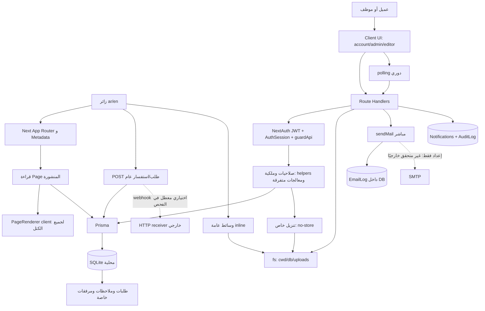
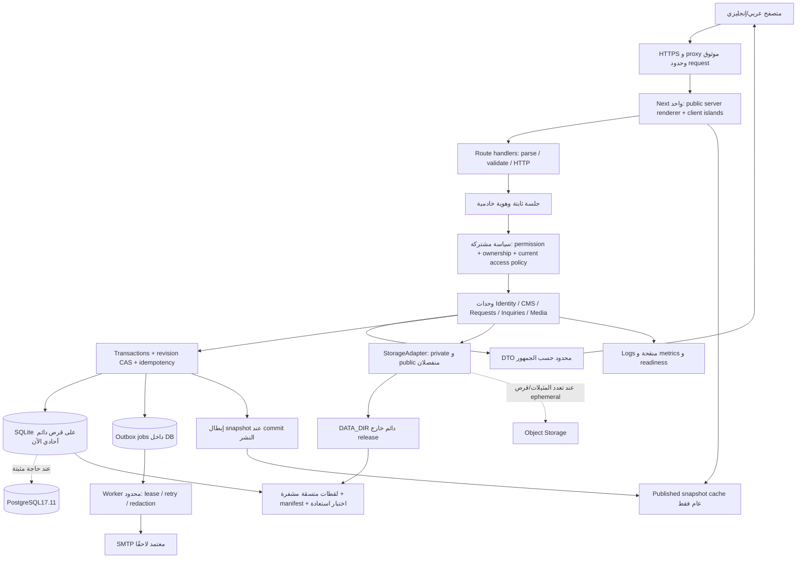

# تقرير فحص سُحُب التقنية وخطة التطوير

**تاريخ التحقق:** 2026-10-02، المنطقة المرجعية Asia/Aden. **الحالة:** تقرير وخطة للاعتماد؛ لم تُنفذ تحديثات التطبيق أو ترحيلات إنتاج أو نشر أو إجراءات GitHub.

## 1. الملخص التنفيذي

المشروع تطبيق Next.js موحد قابل للتطوير التدريجي، وليس موقعًا ثابتًا فقط. يحتوي على موقع عربي/إنجليزي، ومصادقة وبوابة عميل ولوحة إدارة، وطلبات واستفسارات ومحادثات ومرفقات، ومحرر كتل مرتبط بقاعدة SQLite عبر Prisma. البناء والتشغيل المحليان نجحا، لكن بعض الضمانات المذكورة في الوثائق لا يحققها التنفيذ الحالي بالكامل.

نقاط القوة المثبتة: هوية المستخدم تُستخرج من الجلسة على الخادم، وصلاحيات الإدارة مركزية، وملكية الطلب تُفحص، والملاحظات الداخلية تُستبعد من استعلام العميل، ورموز الحساب عشوائية ومحددة المدة وبصماتها محفوظة، وكلمات المرور تستخدم bcrypt، والترجمات متكافئة باختبارات، وهناك ترحيلات وإصدارات صفحات ونشر يتحقق من الكتل. نجح رفض العميل للإدارة ورفض المستخدم الموقوف للدخول وغير المالك لطلب آخر في التجربة المحلية.

أخطر النتائج العملية:

- رمز ربط طلب قديم غير مربوط بمعرّف الطلب: أمكن استخدام رمز يخص تدفق بريد طلب مصطنع لربط طلب مصطنع آخر بالحساب، ثم قراءة بياناته.
- صندوق البريد الإداري يحفظ روابط استعادة الحساب كاملة ويعرضها لدور العمليات؛ ووضع البريد التجريبي يكشف تلك الروابط حتى عند `NODE_ENV=production` إن بقي مفعّلًا.
- أمكن رفع SVG وتشغيل JavaScript عند فتحه من أصل التطبيق؛ وهناك تجاوز صلاحية في مرفقات الاستفسارات وتسريب معلومات عبر لوحة الإدارة وبيانات SEO للصفحات المقيدة.
- فصل المسودة عن المنشور يقتصر على الكتل؛ SEO والمسار وسياسة ظهور الصفحة تتغير مباشرة بصلاحية التحرير. الحفظ المتعارض يقبل كتابة ثانية بالطابع الزمني القديم، والنشر والاستعادة يمسان اللغتين معًا.
- مسار الملفات يعتمد على مجلد تشغيل العملية، ويتغير مع standalone؛ سكربت النسخ الاحتياطي لا يطابق تفسير مسار قاعدة البيانات ولا يقدم لقطة متسقة عند WAL، ومجلد النسخ الاحتياطية غير مستبعد من Git.

**القرار الموصى به:** الإبقاء على Next.js و React و Prisma ومحرر الكتل، وتنظيم التطبيق إلى وحدات داخل المستودع نفسه. إصلاح الوصول والرموز والحفظ والاستمرارية أولًا، ثم ترقيات أمنية متوافقة، ثم استكمال المحرر وروابط المتابعة. لا توجد أدلة تستدعي إعادة كتابة أو microservices أو Kubernetes. يبقى SQLite مبدئيًا **إذا كانت الاستضافة مثيلًا واحدًا ذا قرص دائم**؛ يُنقل إلى PostgreSQL عند تحقق حاجة تشغيلية محددة، وفق خطة منفصلة أدناه.

### نطاق الأدلة وحدودها

| البند | ما ثبت |
|---|---|
| النسخة المفحوصة | الفرع `main`، SHA [`0713b6f4eb4da1df72ab6c4945608648192de8ef`](https://github.com/so7ob/Website/tree/0713b6f4eb4da1df72ab6c4945608648192de8ef)، تاريخ commit: `2026-10-02T18:08:44+03:00` |
| أحدث main | تحقق `git ls-remote` في البداية وقرب إعداد التقرير: مطابق للـ SHA أعلاه؛ لم نغيّر تاريخ Git أو ندفع شيئًا |
| حالة العمل الأصلية | نظيفة عند البدء. لم تُعدّل ملفات التطبيق أو الحزم أو القفل؛ الإضافة المحلية الوحيدة هي هذا التقرير وأدلته |
| المصادر | [AGENTS.md][agents]، [CONTRIBUTING.md][contrib]، [README.md][readme]، `agent-ctx/` المعمارية، المخطط والترحيلات، 50 ملف API تضم 69 معالجًا صادرًا، مصدر الواجهة والمحرر والمصادقة، إعدادات CI والبناء والاختبارات، و 87 تبعية مباشرة |
| البيئة المعزولة | أرشيف tracked files من SHA نفسه في `/tmp/so7ob-audit-20261002/project`؛ نسخة مستقلة من node_modules؛ DB جديدة بمسار مطلق وبيانات مصطنعة؛ بريد تجريبي و SMTP و webhook معطلان؛ الخادمان على loopback 3100 و 3101 |
| قيود الفحص | لا دخول للإنتاج أو مزود الاستضافة أو SMTP الحقيقي، ولا تدقيق لكل تاريخ Git، ولا اختبار اختراق شامل أو حمل طويل أو استعادة إنتاج. نجاح إعداد أو README لا يثبت أن الخدمة الخارجية تعمل |

المصطلحات في التقرير: **حقيقة بالكود** = مسار محدد يثبت السلوك؛ **متحقق بالتشغيل** = تجربة آمنة على النسخة المعزولة؛ **استنتاج** = أثر مرجح يحتاج شروطًا؛ **هدف/تقدير** = اقتراح مستقبلي، وليس قدرة مقاسة. الخطورة «عالية» تعني كشف بيانات/استيلاء على حساب/فقد تعديلات أو تعطل مهم؛ «متوسطة» تعني ضعف اعتمادية أو نطاق أثر محدود؛ «منخفضة» تعني دين صيانة. P0–P3 أولوية عمل، وليست درجات رقمية للأمان.

## 2. جرد التقنيات المستخدمة فعليًا

الإصدار «الفعلي» أدناه هو إصدار `bun.lock` المطابق لـ node_modules المعزولة، إلا الأدوات والمحرك المقاسان مباشرة. النطاق في package.json لا يساوي الإصدار المثبت. [الجرد الكامل CSV](technology-inventory.csv) يسرد **70 تبعية إنتاج و 17 تطوير** بالنطاق والإصدار والترخيص وملفات الاستيراد؛ [JSON التفصيلي](evidence/inventory.json) يحفظ engines و peerDependencies. غياب استيراد TypeScript لا يكفي وحده للحذف، لأن بعض الحزم تُستخدم عبر CLI أو CSS أو Next.js.

| المجال | التقنية | النطاق ← الإصدار الفعلي | الدور | دليل الاستخدام | حالة الاستخدام والدعم | ملاحظات |
|---|---|---|---|---|---|---|
| اللغة | TypeScript | `^5` ← 5.9.3 | التطبيق والسكربتات | [tsconfig][tsconfig]، `src/**/*.ts{,x}` | مستخدمة؛ typecheck ناجح | strict مفعّل لكن noImplicitAny معطّل، وسكربتات وبعض مجلدات الاختبار خارج الفحص |
| الإطار | Next.js | `^16.1.1` ← 16.1.3 | App Router، RSC، Route Handlers، metadata | [package][pkg]، [CMS][cms]، [config][nextconfig] | مستخدم وشُغّل؛ خط 16 Active LTS، النسخة متأخرة أمنيًا | Turbopack؛ standalone؛ تحذير انتقال middleware إلى proxy |
| الواجهة | React / React DOM | `^19.0.0` ← 19.2.3 / 19.2.3 | Server/Client Components و hydration | `src/app`، [PageRenderer][renderer] | مستخدمة وشُغّلت | نسخة React وحدها لا تحدد نسخة RSC المدمجة في Next |
| التشغيل والحزم | Bun / Node | الأداتان 1.4.2 / 20.20.0؛ Node اختبار بديل 24.21.0 | Bun للحزم والسكربتات و start؛ أدوات Next/Vitest تستدعي Node | [scripts][pkg]، [CI][ci] | Bun شُغّل؛ Node20 فشل في اختبار jsdom؛ Node24 اجتاز 67 اختبارًا | لا engines أو تثبيت إصدار Node في المشروع؛ CI يستخدم Bun latest؛ Node20 انتهى دعمه |
| العرض والتوجيه | Next App Router | ضمن 16.1.3 | `/[locale]/[[...slug]]` من DB، ومسارات auth/account/admin | [CMS:10][cms]، `src/middleware.ts` | ديناميكي؛ مسار public يختار publishedBlocks | لا Pages Router في مصدر التطبيق؛ لا إثبات SSR cache إنتاج |
| الحالة وجلب البيانات | React useState/useReducer/useRef + fetch | React19.2.3 | حالة المحرر والنماذج، و helpers للـ API، polling | [editor][editor]، `src/components/account/api.ts` و`src/components/admin/helpers.ts` | مستخدمة | لا TanStack Query أو Zustand في الكود الفعلي؛ polling للمحادثة/الإشعارات |
| التحقق | Zod + تحقق يدوي | `^4.0.2` ← 4.3.5 | مخططات 27 نوع كتلة؛ النماذج والعديد من APIs يدوياً | [blocks][blocks]، `src/lib/validation.ts` | مخططات الكتل تعمل؛ ليست كل مدخلات API مخططة | إرجاع نتيجة safeParse لا يعني تخزين القيمة المطَبَّعة؛ انظر F18 |
| التصميم | Tailwind / PostCSS / tw-animate-css | `^4` ← 4.1.18 / 4.1.18؛ `^1.3.5` ← 1.4.0 | CSS utilities والتحريك | `postcss.config.mjs`، `src/app/globals.css` | مستخدمة في البناء | tailwindcss-animate1.0.7 تبعية legacy تحتاج إثبات حاجة مستقلة |
| المكونات | Radix، مكونات shadcn محلية، Lucide، Sonner | Radix إصدارات مفصلة في CSV؛ Lucide0.525.0؛ Sonner2.0.7 | حوارات وقوائم وتبويبات وأيقونات وتنبيهات | `src/components/ui/` والمحرر | مستخدمة جزئيًا؛ مكتبة UI أوسع من المسارات النشطة | shadcn مصدر منسوخ وليس إصدار npm واحدًا؛ لا تحذف Radix بمجرد عدم استخدام صفحة معينة |
| الحركة | Framer Motion | `^12.23.2` ← 12.26.2 | مقدمة الموقع والعناصر البصرية | [hero:39][hero] | مستخدمة؛ خلل reduced-motion متحقق | ليس سببًا لاستبدال النظام كاملًا |
| الخطوط | IBM Plex Sans / Arabic | `^5.3.0` ← 5.3.0 لكليهما | ملفات خطوط محلية بأوزان 400/500/600/700 | `src/app/[locale]/layout.tsx` | مستخدمة؛ OFL-1.1 | imports للغتين في layout؛ نُقلت 136–251KiB خطوط في القياس حسب الصفحة واللغة |
| الترجمة والاتجاه | قاموس يدوي typed | مصدر المشروع؛ next-intl `^4.3.4` ←4.7.0 مثبتة فقط | محتوى ar/en، portal ar/en، localePath، dir/lang | `src/lib/i18n.ts`، `src/content/{ar,en}.ts` و portal | القواميس مستخدمة واختبارات تكافؤ ناجحة | next-intl ليست طبقة الترجمة الحالية؛ لا ضرورة لإدخالها لمجرد تثبيتها |
| المحرر المرئي | محرر كتل محلي + dnd-kit | core6.3.1 / sortable10.0.0 / utilities3.2.2 | إضافة وترتيب وخصائص و undo/redo وحفظ | [editor][editor]، [canvas][canvas] | شُغّل وظهرت واجهته باللغتين | PointerSensor و KeyboardSensor؛ حد 60 كتلة؛ لا تخطيطات متداخلة عامة |
| النص الغني | فقرة/عنوان/تنبيه؛ MDXEditor مثبتة | MDXEditor `^3.39.1` ←3.52.3 | richText الحالي يعرض strings في p | [richText:12][richtext]، props-form | الحالي مستخدم؛ MDXEditor بلا import | لا تنسيق inline أو WYSIWYG غني حاليًا؛ تثبيت الحزمة لا يثبت وجود الميزة |
| العارض والقوالب والإصدارات | PageRenderer + PageVersion | مصدر المشروع | switch لكل الكتل؛ نسخ صفحة، قالبان أوليان؛ versions حسب اللغة | [renderer][renderer]، [page-create][pagecreate]، [schema:448][pageversion] | النشر والاستعادة شُغّلا؛ استكمال مطلوب | import ثابت لكل العارضات client؛ snapshots للكتل وحدها، نشر/استعادة اللغتين معًا |
| قاعدة البيانات | SQLite | Prisma runtime: 3.46.0 | جميع بيانات التطبيق، 23 جدول تطبيق + جدول ترحيلات | [schema][schema]، [DB][db]، [probe](evidence/probe-results.json) | شُغّلت فقط قاعدة اصطناعية؛ journal_mode=delete؛ integrity_check=ok | لا دليل عن حجم قاعدة الإنتاج أو WAL أو أقراصها |
| ORM والترحيلات | Prisma / client | `^6.11.1` ←6.19.2 لكليهما | استعلامات parameterized، علاقات وفهارس و transactions | [DB][db]، `prisma/migrations/` | 4 migrations اجتازت إعادة التشغيل في العزل | لا unsafe raw SQL في التطبيق المفحوص؛ ترقية CLI/client زوج متطابق |
| النسخ الاحتياطي | سكربت نسخ ملف | مصدر المشروع | نسخ DB إلى db/backups | [backup][backup] | موجود؛ فشل المسار النسبي في الاختبار، WAL-copy فشل | لا retention/offsite/restore drill أو backup للملفات مُثبت |
| المصادقة | NextAuth v4 Credentials + bcryptjs | `^4.24.11` ←4.24.13؛ bcryptjs3.0.3 | JWT و AuthSession مخصص وصلاحيات DB | [options][options]، [guard][guard]، [permissions][permissions] | الدخول والأدوار شُغّلت؛ عيوب التطبيق F01–F03/F14 | لا OAuth أو NextAuth EmailProvider؛ cost bcrypt12؛ لا provider خارجي ثابت |
| الرموز | crypto randomBytes/SHA256 | API قياسي من runtime | email verify/reset/request claim، invitations | [tokens][tokens]، [schema:95][authtoken] | مدة وبصمة موجودتان؛ single-use الذري غير صحيح | لا token مورد محدد للـ claim؛ EmailLog يعيد حفظ الرمز ضمن النص |
| الأدوار والملكية | 5 أدوار + مصفوفة صلاحيات | مصدر المشروع | super_admin/ops_manager/support/content_editor/client | [permissions][permissions]، `src/db/seed-roles.ts` | حراس أغلب APIs موجودة؛ اختبارات الرفض الأساسية ناجحة | بعض استجابات dashboard/files/CMS تتجاوز صلاحية المجال |
| الطلبات والاستفسارات | ProjectRequest/Inquiry + messages/events/drafts/saved replies | مصدر المشروع | إرسال عام، ربط حساب، تعيين ومحادثة وملاحظات | [request-service][requestservice]، APIs account/admin/inquiries | وحدات فعلية؛ مسارات نموذجية شُغّلت | refCode ليس رابط bearer آمنًا؛ guest view/reply وسياساته غير موجودة |
| المرفقات والوسائط | fs محلي + Prisma metadata | مصدر المشروع | private Attachment و public MediaItem؛ تنزيل خاص no-store | [storage][storage]، [attachment][attachment]، [media][media] | upload/download شُغّلا؛ عيوب SVG/path/ownership مثبتة | read/write متزامنان؛ لا S3/CDN موثَّق؛ sharp0.34.5 موجودة لدعم Next أيضًا |
| البريد والإشعارات | Nodemailer + EmailLog + Notification | `^10.0.13` ←10.0.13 | SMTP مشروط، mock outbox، إشعارات DB/polling | [email][email]، `src/lib/auth/notifications.ts` | mock متحقق؛ SMTP الحقيقي غير متحقق | لا طابور دائم أو retries؛ الإرسال المباشر قد يطيل الطلب |
| التكامل الخارجي الاختياري | HTTP webhook | API fetch من runtime | إشعار طلب جديد مع contact/description preview | `src/lib/notify.ts:48` و`src/app/api/requests/route.ts:139` | إعداد موجود؛ NOTIFY_WEBHOOK_URL فارغ في الفحص | timeout5s ولا retry؛ الجهة المتلقية وصلاحية نقل PII غير متحققين؛ لا نفترض Slack/Discord يعملان |
| الاختبارات | Vitest، jsdom، Testing Library | 5.0.3 /30.1.1 /React16.3.3 /jest-dom7.0.1 /user-event14.6.7 | unit/component/translation tests | `vitest.config.ts`، `tests/`، `src/**/__tests__/` | 67 ناجحة على Node24؛ فشل worker على Node20 | ليس هناك E2E أمني أو DB integration دائم في CI |
| CI/CD والتشغيل | GitHub Actions + standalone | checkout@v4، setup-bun@v2 | lint/typecheck/test/build/diffcheck | [CI][ci]، [config][nextconfig]، [scripts][pkg] | إعداد CI موجود؛ لم نفحص تنفيذ Actions البعيد | لا workflow نشر أو Docker أو مراقبة/healthcheck في المشروع؛ الاستضافة الفعلية مجهولة |
| السجلات | AuditLog/EmailLog + console + tee | مصدر المشروع | أحداث التطبيق والبريد و server.log | `src/lib/auth/audit.ts`، [email][email]، [scripts][pkg] | تسجل فعليًا في التجربة | لا مخطط redaction/retention أو metrics/traces مثبت |

[سياسة دعم Next.js](https://nextjs.org/support-policy)، [دعم Node.js](https://nodejs.org/en/about/previous-releases)، [متطلبات Prisma](https://docs.prisma.io/docs/orm/reference/system-requirements)، [توثيق MDXEditor](https://mdxeditor.dev/editor/docs/overview) تحققت بتاريخ التقرير. الدعم المذكور يتعلق بخط الإصدار، ولا يعني أن النسخة القديمة تحتوي على إصلاحاته.

### الحزم غير النشطة والمتكررة

| الدليل | القرار المقترح بعد الاعتماد | حدود الاستنتاج |
|---|---|---|
| صفر import في مصدر التطبيق: next-intl4.7.0، Zustand5.0.10، TanStack Query5.90.19/Table8.21.3، @reactuses/core6.1.9، @hookform/resolvers5.2.2، react-markdown10.1.0، syntax-highlighter15.6.6، uuid11.1.0 | PR تنظيف مستقل بعد فحص graph و build/test؛ إبقاء الترجمة والحالة اليدويتين الحاليتين | الحزمة المثبتة لا تعني JavaScript مشحونًا للمتصفح؛ لا نحسب وفرًا دون بناء قبل/بعد |
| react-hook-form7.71.1 مستوردة في ui/form فقط؛ Recharts2.15.4 في ui/chart فقط؛ بعض Radix في primitives غير مستعملة بالرحلات الحالية | تحديد reachability للمكونات قبل حذف الحزمة/primitive؛ لا استيراد جديد تلقائيًا | لا يكفي search لحذف مكتبة يستخدمها إطار/CLI؛ الشاشات الإدارية تستعمل رسومًا بسيطة محلية |
| @mdxeditor/editor3.52.3 بلا import | الاحتفاظ مؤقتًا وتقييم تشغيله في P2 للنص الغني؛ لا إدخاله في bundle العام | ميزة مخططة، وليست حالية |
| z-ai-web-dev-sdk0.0.18 في أمثلة/ملحقات خارج التطبيق، لا import من src | إخراج SDK غير اللازم من dependencies النشطة إذا أكد graph عدم الحاجة | أمثلة لا تثبت تكامل AI إنتاج؛ جزء من التنبيهات يأتي من شجرة SDK |
| tailwindcss-animate1.0.7 مقابل tw-animate-css1.4.0؛ @vitejs/plugin-react6.1.1 غير مستخدمة في إعداد Vitest | حذف legacy/plugin إن أكد فحص CSS/config ذلك في PR مستقل | لا حذف Tailwind/PostCSS/Prisma/React DOM/sharp بناءً على صفر import؛ استخدامها قد يكون غير مباشر |

## 3. سجل نتائج الفحص حسب الخطورة

كل معيار قبول أدناه **مقترح للتطوير**. تفاصيل التشغيل غير الحساسة في [api-audit](evidence/api-audit.json)، [الاختبارات الإضافية](evidence/more-results.json)، [probes](evidence/probe-results.json)، [dashboard](evidence/dashboard-access.json). لا تتضمن الأدلة رموزًا خامًا أو قواعد بيانات أو بيانات عملاء حقيقية. نتائج API الأولية للمرفقات كانت 404 بسبب اختلاف المسار؛ نتيجة 200/403 بعد تصحيح **موضع ملفات الاختبار فقط** هي المستخدمة للحكم على الصلاحية.

### نتائج عالية الخطورة — P0

| الرقم والمشكلة | الدليل والموضع | الأثر وشروطه | الإثبات | المعالجة المقترحة ومعيار قبولها |
|---|---|---|---|---|
| F01 — إثبات ملكية الطلب غير مربوط بالطلب | [issueToken:24][tokensissue]، [claim:51][claim]، [verify:23][claimverify]، AuthToken لا يحمل resourceId | من يعرف refCode لطلب غير مربوط يستطيع بدء pending claim ثم استخدام رمز تدفق طلب يملكه لربط المورد الآخر؛ refCode وحده يجب ألا يكون إثبات ملكية | تشغيل: victim/own claim200، verify307، قراءة الضحية 200 بواسطة رمز تدفق الطلب الآخر؛ البريد كله مصطنع | token مرتبط بـ claimId/requestId/userId/الغرض/expiry، وتحقق واستهلاك وربط ذري. قبول: تبديل ref/resource/user يفشل، غير المالك 403؛ الرابط الصحيح فقط يعمل مرة واحدة |
| F02 — تسريب رموز الحساب من البريد | [email:41][emailstore] و[75][emailsmtp]، [outbox:16][outbox]، permissions للدور ops_manager | قارئ outbox يرى reset/verify/invite links الخاصة بمستخدمين أعلى صلاحية؛ ينطبق حتى مع SMTP لأن نص الرسالة محفوظ. استيلاء الحساب أثر محتمل عند رمز صالح، لم ننفذ استيلاء على حساب حقيقي | تشغيل: ops outbox200 ونصه يحتوي رمز الاستعادة الاصطناعي | outbox metadata فقط مع redaction قبل التخزين والعرض؛ إزالة bodies القديمة الحساسة بمعالجة مُعتمدة وسياسة retention. قبول: لا token في API/DB logs/console، و ops لا يستخرج secret من أي تدفق |
| F03 — وضع بريد تجريبي غير محظور بالإنتاج | [email:26][emaildev]، `src/app/api/auth/forgot-password/route.ts`، `.env.example` | تفعيل EMAIL_DEV_MODE بالإنتاج يعيد devResetUrl و devVerifyUrl للمتصفح؛ لا حاجة للسيطرة على بريد الضحية. شرط الإعداد معلوم؛ إعداد الإنتاج الفعلي مجهول | تشغيل standalone مع NODE_ENV=production و mock محلي: devResetUrlReturned=true | startup validation يمنع dev mode بالإنتاج، والـ API لا يعيد raw links في وضع الإنتاج. قبول: boot يفشل بإعداد غير آمن، ورد forgot/register/claim لا يحتوي روابط سرية؛ SMTP غير مضبوط يظهر فشلًا داخليًا قابلًا للرصد |
| F04 — SVG عام ينفذ على أصل التطبيق | [storage:32][storagetypes]، [media:19][mediadelivery]، `src/app/api/admin/media/route.ts` | محرر وسائط قادر على رفع محتوى نشط؛ فتح الرابط قد ينفذ إجراءات بامتياز جلسة الزائر. MIME من العميل ليس فحصًا للملف؛ nosniff لا يمنع SVG JavaScript | تشغيل: upload201؛ علامة JavaScript حميدة نُفذت عند فتح SVG من نفس الأصل | منع SVG النشط فورًا، signature/content inspection، rasterization أو sanitization مثبتة + أصل ملفات منفصل بلا cookies عند الحاجة. قبول: payloads SVG/HTML/polyglot لا تنفذ؛ مسارات الملفات الخاصة لا تصبح عامة؛ quotas وحجم upload محددان |
| F05 — مرفق الاستفسار يتجاوز صلاحيات المجال | [attachment:18][attachment]؛ الفرع else يقيد client فقط | content_editor بلا صلاحية inquiries يقرأ مرفقها؛ client مالك استفسار قد يُمنع من مرفق رفعه موظف لأن الشرط يختبر uploader وليس مالك inquiry | تشغيل: editor inquiry attachment200 بعد وضع الملف الاصطناعي في مسار standalone؛ client آخر 403 | canAccessInquiry مشتركة للصفحة/API/تنزيل الملف، ارتباط واحد صحيح لكل attachment. قبول: مصفوفة owner/nonowner/content_editor/support/suspended لكل request/inquiry ولملف رفعه موظف؛ كل الرفض قبل قراءة bytes |
| F06 — تجاوز allowedRoles وتسريب metadata | [CMS:106][cmsroles]، [metadata:45][cmsmetadata] | كل staff مقبول رغم allowlist؛ anon يحصل على SEO لصفحة مقيدة ضمن استجابة redirect. noindex لا يمنع كشف المعلومات | تشغيل: editor يرى صفحة allowlist=support200؛ anon307 يحوي SEO marker | predicate وصول واحدة قبل metadata والمحتوى؛ استثناء super_admin صريح ومعتمد فقط. قبول: جميع أدوار خارج allowlist ممنوعة و HTML/RSC/meta لا تكشف الحقول المقيدة |
| F07 — dashboard يكشف بيانات خارج صلاحية المستخدم | [dashboard:10][dashboard]، [43][dashboarddata]، `src/app/[locale]/admin/page.tsx` | صلاحية admin.dashboard تمنح content_editor أسماء عملاء وطلبات وأحداث تدقيق؛ التصاريح المنفصلة requests/users/audit لا تُستخدم لتشكيل الرد | تشغيل: editor200، 8 طلبات وأسماء عملاء/فاعلي audit ظاهرة | DTO وحساب metrics لكل permission، ونفس سياسة SSR. قبول: editor يشاهد المحتوى المسموح فقط؛ دعم/عمليات لا يحصلان على مجالات محظورة؛ اختبار JSON و HTML معًا |
| F08 — الحقول التحريرية المشتركة تُنشر عند الحفظ | [page PATCH:104][pagepatchmeta]، [CMS:26][cmsselect]، [schema:402][page] | محرر pages.edit دون pages.publish يغير SEO/title/slug/visibility/isHome/order في الموقع مباشرة؛ حماية المسودة لا تشمل كل الحقول. بعض تغييرات seed SEO قد تُكتب فوقها | تشغيل: unpublishedSeoVisible=true؛ نشر محرر مرفوض 403 لكن SEO يصل للعامة | snapshots draft/published كاملة + فصل لغة/خصائص مشتركة مع صلاحية نشر صريحة؛ لا تبديل routing/ACL تلقائيًا. قبول: تغيير أي حقل مؤثر لا يغير public قبل نشره، ولا يسرّب draft في HTML/RSC/sitemap/navigation |
| F09 — منع تعارض الحفظ غير ذري | [PATCH:78][pagecas]، [update:148][pageupdate]، [editor:210][editorsave] | timestamp اختياري، سماح بفارق 1500ms، قراءة ثم كتابة بلا شرط DB؛ آخر كاتب يمحو تعديل الآخر، و payload يحمل اللغتين | تشغيل: حفظان متتابعان بنفس النسخة القديمة 200/200؛ ثانيهما يستبدل الأول | revision integer إلزامي لكل locale/metadata، تحديث where id+revision ثم زيادة ذرية، queue للطلبات المحلية. قبول: 10 حفظات لنفس revision تعطي نجاحًا واحدًا و 9 تعارضات 409؛ لا تضيع اللغة الأخرى؛ conflict قابل للمراجعة دون discard صامت |
| F10 — الرمز أحادي الاستخدام يُستهلك عدة مرات متزامنة | [consumeToken:33][tokensconsume]، reset/verify/claim callers | read-then-update يسمح باستخدام الرمز عدة مرات؛ claim يستهلكه قبل فحص المورد. دعوات المستخدم كذلك تحتاج مراجعة الذرية بين إنشاء الحساب وتعليم الدعوة مستخدمة | تشغيل مساعد consumeToken على DB منفصلة: 10 نجاحات من 10 لمحاولة رمز واحد متزامنة؛ ليس كل تدفق HTTP أُعيد بهذه الصورة | conditional update على usedAt=null/expiry/type/resource ضمن transaction للعملية المرتبطة. قبول: استخدام متزامن واحد فقط، ولا تُستهلك رابطة عند جلسة/مورد غير صحيح، ولا حسابات جزئية بعد فشل العملية |
| F11 — استمرار الملفات والنسخ الاحتياطي غير مضمون | [storage:9][storage]، [backup:8][backuppath]، [.gitignore][ignore] | standalone يغيّر cwd؛ إعادة build/deploy قد تعزل الملفات أو تفقدها إن كانت داخل artifact. النسخ العادي لا يضمن snapshot DB حية؛ db/backups غير ignored يعرض بيانات مستقبلية للرفع العلني | تشغيل: تنزيل المالك 404 ثم 200 بعد نقل fixture لموضع standalone؛ سكربت المسار النسبي exit1؛ WAL fixture raw copy: جدول مفقود، online backup: صف صحيح. DB الاختبار الحالي journal=delete | DATA_DIR مطلق خارج releases، DB path canonical، online backup/لقطة بعد وقف الكتابة، offsite encrypted backup للـ DB+files+manifest. قبول: upload ثم restart/rebuild يبقى readable؛ restore drill counts/checksums/FK سليمة؛ git check-ignore يرفض backups/DB/WAL؛ RPO/RTO مُعتمدان ومقاسان |
| F12 — تأخر إصلاحات إطار التطبيق | Next16.1.3/React19.2.3/sharp0.34.5 مقابل إصدارات رسمية إصلاحية؛ انظر مصفوفة التنبيهات التالية | App Router/RSC جزء نشط يطابق تنبيهات DoS؛ أثر AVIF مرتبط بوصول بيانات متحكم بها إلى image optimizer. ليس إثبات RCE شامل للتطبيق | file lock + advisory matching؛ لم نجرِ payload تعطيل أو استغلال RCE | ترقية متوافقة في PR منفصل، اختبار DB/auth/editor/build/image surface، إغلاق optimizer غير المستخدم إذا لزم. قبول: تنبيهات قابلة للوصول مُصلحة أو تعطيل موثَّق، لا تراجع رحلات أو إدخال downgrade غير آمن |

### نتائج متوسطة الخطورة — P1/P2/P3

| الرقم والمشكلة | الدليل والموضع | الأثر | الإثبات | المعالجة ومعيار القبول |
|---|---|---|---|---|
| F13 — غياب النشر والاستعادة المستقلين للغة | [publish:25][publish]، [restore:21][restore] | نشر العربية ينشر الإنجليزية المعدلة أيضًا؛ اختيار رقم version يعيد مسودتي اللغتين؛ تاريخ الكتل لا يحفظ SEO والسياسات | تشغيل: طلب نشر مع locale=ar أنشأ إصداري ar/en ونشر تعديل الإنجليزية؛ restore شُغّل. خادم النشر يتجاهل locale | endpoints locale+revision، snapshot كاملة، diff/read-only version review، restore إلى draft فقط. قبول: hash/version للغة الأخرى لا يتغير، ولا نشر تلقائي عند الاستعادة |
| F14 — هوية الجلسة وإبطال «الجلسات الأخرى» | [options:102][sessioniat]، `src/app/api/auth/sessions/route.ts` | sid مشتق من userId+iat قابل للتبدل عند إعادة توقيع NextAuth؛ نافذة bootstrap60s، UA/IP غائبان في الإنشاء. all=true يبطل المستخدم الحالي أيضًا عبر sessionsRevokedAt | تشغيل: إبطال الآخرين 200 ثم profile للجلسة الحالية 401. collision بنفس الثانية لم يثبت: ظهرت جلستان؛ بقية الأثر بالكود ويحتاج اختبار rolling/60s | sid عشوائي ثابت يُنشأ عند الدخول، DB سجل دقيق، immutable issuedAt، revoke المحدد دون cutoff يطال current. قبول: current تبقى، others401، تغيير role/status/password يطبق كما اعتمد؛ cookie refresh والانتظار لا يولدان جلسات أو logout غير مطلوب |
| F15 — حماية آخر مدير قابلة للتجاوز | `src/app/api/admin/users/[id]/route.ts:149,163` | count ثم update بلا transaction، والحماية لا تغطي تحويل آخر super_admin إلى pending_verification؛ قد يقفل الفريق حساب الإدارة | كود؛ لم نجرب تعطيل مديري إنتاج | invariant ذري لكل status/role transition، recovery runbook. قبول: تعديلان متزامنان أو pending لا يتركان صفر مدير نشط؛ deny client/suspended/غير صاحب users.roles |
| F16 — تغييرات الأعمال وإعادة المحاولة غير متسقة | [request-service:145][messageswrite]، publish aggregate خارج transaction، PATCH home/redirect؛ invite/settings APIs | message ثم status ثم notify/audit قد تُحفظ جزئيًا؛ retry قد يكرر؛ duplicate-message يقرأ آخر رسالة فقط ويفصل check/create؛ max(version)+1 يتسابق | كود؛ القياس التسلسلي لم يعط 500 ولا يثبت صحة التزامن | service transaction للحقائق الأساسية + idempotencyKey unique scoped، outbox للأثر الخارجي، invariant ل home/slug/version. قبول: retries متزامنة تعيد نتيجة واحدة، فشل البريد لا يفقد الرسالة؛ failure injection قبل/بعد commit يثبت اتساق الحالة |
| F17 — pending claim دائم وتعطيل تدفقات الربط | [claim:48][claimblock]، [issueToken:27][tokensissue]، RequestClaim | أول طلب pending يمنع أي محاولة لاحقة بلا expiry/retry؛ رمز claim جديد للمستخدم يبطل رموزه الأخرى. فرصة حجز طلب غير مربوط وتعطيل مالكه | كود؛ تجربة F01 أنشأت pending متعدد الموارد | pending expiry/nonce لكل مورد، إعادة إرسال آمنة، تنظيف/إلغاء، حد محاولات. قبول: المالك يستطيع الربط بعد انتهاء/إلغاء pending؛ بدء طلب ثانٍ لا يبطل رمز الأول |
| F18 — تحقق API ناقص وأنواع كتلة موروثة | [blocks:436][blockcheck]، [PATCH:67][pagebody]، request/inquiry/list APIs | JSON null/مصفوفة وقيم page غير صحيحة قد تسبب 500؛ `type in blockSchemas` يقبل __proto__/constructor/toString ثم يرمي exception؛ تخزين raw JSON يفقد normalization | التشغيل المباشر: أنواع prototype الثلاثة ترمي exception؛ بقية null/pagination بالقراءة، لا ادعاء HTTP exploit لها | object schemas + bounded body + integer pagination + own-key check؛ تخزين validated output. قبول: corpus مدخلات تالفة 400 ثابتة بلا 500، defaults/unknown keys معلومة؛ لا SQL unsafe، URL protocols allowlist |
| F19 — حدود المعدل و Origin غير مكتملة | [ratelimit:20][rate]، [origin:63][origin]، public request/inquiry، auth/options | Map بلا eviction للنقاط القديمة، كل process مستقل؛ raw x-forwarded-for يعتمد على proxy غير متحقق؛ بعض البريد/الرفع/الردود بلا quotas. Origin يقارن host فقط ويقبل غيابه | كود؛ cross-origin PATCH403 متحقق. لم نثبت CSRF متصفحي لأن SameSite و JSON/preflight يوفران حواجز إضافية | trusted proxy واحد مع إزالة header العميل، bounded TTL/LRU، user/IP/body limits، base origin كامل، سياسات واضحة لكل write. قبول: bursts429 وحد أقصى للذاكرة، headers مزيفة لا تتجاوز الحد، cross-site writes مرفوضة؛ shared store فقط عند مثيلات متعددة |
| F20 — بيانات الهوية والـ DTO أوسع من المطلوب | `src/app/api/requests/route.ts:94`، inquiry route؛ [client serializer:58][clientdto] | name/email من session تُستبدل لاحقًا بحقول body مع بقاء clientId صحيحًا؛ الرد إلى client يضم DB scalar/metadata زائدًا كـ storedName وحقول داخلية للتشغيل | كود؛ عزل internal_note في الطلب متحقق (marker=false)، لا ندعي تسريبها في serializer نفسه | فصل contact snapshot عن identity، DTO allowlist لكل جمهور، note kind و attachment visibility. قبول: userId/role/ownerId لا يؤخذ من body، authenticated identity ثابتة حسب السياسة؛ private fields لا تصل للعميل/guest/log/cache |
| F21 — بريد مباشر بلا إعادة محاولة واستعلام N+1 | [request-service:223][mailfanout]، [email:60][emailsmtp] | إرسال متسلسل لكل موظف و findUnique لكل واحد؛ فشل البريد/انقطاع السيرفر لا يعاد تلقائيًا؛ EmailLog ليس queue | كود؛ SMTP الحقيقي غير مشغّل في الفحص | jobs داخل DB تُنشأ مع المعاملة، worker محدود مع lease/CAS و backoff/maxAttempts وتنبيه failed. قبول: response لا ينتظر SMTP؛ restart يستأنف jobs؛ لا كشف رموز للعامل/الدور غير المصرح؛ dedup ولا ادعاء exactly-once SMTP |
| F22 — استعلامات وردود تنمو مع البيانات | [request-service:61][clientdto]، `src/app/api/admin/requests/route.ts:17,103`، [dashboard:50][dashboarddata] | المحادثة تعيد التاريخ كله مع polling؛ list يجلب كل messages للطلبات المختارة لتحديد آخر رسالة؛ overdue و stats يتعاملان مع مجموعات كاملة | تشغيل: رد تفاصيل طلب بعد 500 رسالة إضافية 238,780 bytes، dashboard20 استعلامًا مع auth؛ لا فشل locking في الحمل القصير | cursor pagination/delta، select/take لآخر رسالة/aggregates، deadline query/index بعد EXPLAIN. قبول: حجم وعدد الصفوف bounded مع 1k/10k fixtures، أول 50 رسالة≤50KiB، query count لا يزيد خطيًا؛ لا ادعاء أن 20 query وحدها N+1 |
| F23 — bundle عام ومحرر أكبر من الحاجة | [renderer:1][renderer]، الكتل كلها client، [layout fonts][layout]، image/gallery | كل عارضات 27 نوع كتلة تُستورد في Client boundary؛ pure text/CMS لا تحتاج كلها hydration؛ الصور img بلا أبعاد/srcset؛ الحفظ يصير مع state واسع | تشغيل: home/contact227KiB JS encoded و 753KiB decoded؛ editor416KiB encoded/1,443KiB decoded. profiling تكرار render لم يُنفذ | عارض server للكتل الساكنة وجزر تفاعل، lazy editor/rich-text/media dialogs، خطوط حسب locale، صور dimensions/variants. قبول: تخفيض budget دون تغيير التصميم وصدق works؛ profiler60-block page قبل/بعد، حفظ لا يعيد كل الكتل غير المعدلة |
| F24 — إتاحة وحركة ومعاينة أجهزة غير صحيحة | [hero:39][hero]، [editor:660][editortabs]، preview width في editor، screenshots/axe | reduced-motion يخفي headline/CTA و art؛ Tabs aria-controls بلا tabpanel؛ تباين hints/أزرار؛ preview يضيق container ولا يغير viewport CSS؛ mobile account CLS≈0.188 | تشغيل ar/en: hero opacity0 مع reduce و 1 دونها؛ axe contrast و ARIA، CLS. صحة preview بالكود؛ keyboard كاملة تحتاج اختبار | initial=false/visible في reduce، TabsContent صحيح، contrast AA، skeleton ثابت، iframe preview ذو viewport محكوم. قبول: الأربع حالات lang/width + الحركة تعمل؛ axe صفر critical/serious؛ Tab/Enter/Escape و focus trap/SR يدوي؛ preview يطابق صفحة فعلية 375/768/1280 |
| F25 — فقد تعديلات عند التنقل/الشبكة | [editor:409][leaveguard]، autosave hooks، `src/components/form/project-request-form.tsx` | beforeunload لا يغطي كل Next Link navigation؛ debounce request draft و autosave بحاجة اختبار unmount/offline/order؛ لا حماية كافية مثبتة لجميع الرحلات | كود؛ لم نفحص كل internal-navigation/failure سيناريو. توجد retry UI و conflict dialog، لا نقول لا معالجة أخطاء مطلقًا | pending-save queue، navigation guard، draft recovery scoped للمستخدم، retries idempotent. قبول: تعديل ثم خروج/انقطاع/عودة لا يختفي بلا تنبيه؛ حفظ قديم بطيء لا يسبق الجديد؛ لا draft حساس في cache عام |
| F26 — seed قد يعيد/يمحو محتوى محرر | [seed:214][seed]، [PATCH:98][pagecas] | lookup بالـ slug بدل sourceKey؛ rename قد يعيد الصفحة القديمة في reseed، وتعديل metadata فقط لا يضع editorTouchedAt فلا يحميه seed | كود؛ seed rerun العادي ناجح، edge cases لم تُجرَّب؛ F08 أثبت تعديل SEO خارج block flow | sourceKey ثابت unique عند الحاجة + mark touched لكل edit؛ seed create-only للمواد التحريرية بعد bootstrap. قبول: run مرتين وبعد rename/SEO-only لا تكرار ولا تغيير checksum لمحتوى المستخدم؛ menu/settings تُحترم |
| F27 — CI وجودة الأنواع لا تغطي المخاطر | [CI][ci]، [eslint][eslint]، [tsconfig][tsconfig]؛ editor≈1038 سطر، requests-client≈813/detail≈742 | Bun latest بلا Node pin؛ لا DB integration/E2E/security rejection tests؛ تعطيل واسع لقواعد hooks/types/unused يجعل lint pass محدود الدلالة؛ helpers وتحقق overdue مكرر | تشغيل Node20:6 ملفات 63 tests pass لكن worker jsdom يفشل؛ Node24:7 ملفات 67pass. typecheck/build/lint pass | تثبيت الأدوات، مصفوفة runtime، tests حقيقية للعيوب، types للـ DTO، extraction modules ثم إعادة rules تدريجيًا. قبول: كل 5checks + migration/restore/security/browser gates؛ زيادة صرامة دون disable جماعي أو حذف اختبارات |
| F28 — CSV formula injection في التصدير | `src/app/api/admin/requests/export/route.ts:44` و`inquiries/export/route.ts:18` | csvEscape يقتبس الفواصل/الاقتباسات فقط؛ حقل مدخل يبدأ بعلامة صيغة قد يُفسَّر في spreadsheet عند فتح ملف موظف | كود؛ لم نشغل Excel/LibreOffice أو نستغل صيغة خارجية | تصدير يعامل الحقول غير الموثوقة كنص وفق السياسة المختبرة؛ corpus يشمل =/+/-/@ و tabs/newlines. قبول: الملف يبقى صالحًا وحقول المستخدم لا تُنفذ كصيغ في أدوات الفريق؛ يُدرج ضمن W07؛ [مرجع OWASP](https://community.owasp.org/attacks/CSV_Injection) |
| F29 — أداة حسابات demo بكلمات مرور ثابتة | `scripts/restore-demo-users.ts` | تشغيلها على DB إنتاج قد ينشئ/يعيد حسابات قابلة للدخول بقيم علنية؛ لا guard يمنع production. لا دليل أنها شُغلت هناك | كود؛ لم نطبع القيم أو نستخدم الأداة | guard محلي صريح مع DB اختبار فقط، وإخراجها من مسار التشغيل الإنتاجي؛ مراجعة الحسابات القائمة بتفويض منفصل. قبول: التشغيل ببيئة إنتاج أو DB غير مصطنعة يُرفض؛ ضمن W01/W07 |

### أثر التنبيهات المنشورة على هذا التطبيق

`bun audit --json` أعطى [96 سجل تنبيه على 25 حزمة](evidence/dependency-advisory-summary.json): 3critical و 52high و 36moderate و 5low حسب قاعدة بيانات الأداة. **هذه ليست 96 ثغرة قابلة للاستغلال في الموقع**: توجد سجلات متعددة للحزمة وتنبيهات dev وتبعيات dormant. [النتيجة الكاملة](evidence/dependency-advisories.json) محفوظة للمراجعة؛ خطورة الأداة قد تختلف عن تصنيف maintainer، ولم نعتمد CVSS لتقييم المشروع.

| المصدر الرسمي، تحقق 2026-10-02 | الاستخدام الفعلي/الأثر | القرار |
|---|---|---|
| [Next/RSC CVE-2026-23864](https://github.com/vercel/next.js/security/advisories/GHSA-h25m-26qc-wcjf)، [React RSC security](https://react.dev/blog/2025/12/11/denial-of-service-and-source-code-exposure-in-react-server-components) | Next16.1.3 يسبق fix16.1.5؛ App Router/RSC نشطان. قابلية DoS تستدعي التصحيح؛ لم تُنفذ حمولات تعطيل | تحديث Next إلى خط 16 المصحح؛ تحديث React وحدها غير كافٍ لحزم Next المدمجة |
| [Next أغسطس 2026](https://nextjs.org/blog/august-2026-security-release)، [sharp libheif](https://github.com/advisories/GHSA-rgj7-g3m4-5g8c) | sharp0.34.5 قديمة؛ optimizer موجود ضمن الإطار رغم عدم استعمال next/image في صفحات CMS. تحقق من AVIF غير موثوق وإتاحة endpoint في النشر. مشكلة Windows المختلط Pages/App لا تنطبق على بيئة Linux/App المفحوصة | upgrade/harden image endpoint؛ لا نصفه RCE مُثبتة في التطبيق |
| [Next سبتمبر 22: ImageResponse](https://nextjs.org/blog/nextjs-security-update-september-22-2026) | نطاق>=16.2<16.3.6؛ النسخة 16.1.3 خارجه، ولا next/og في src | لا يُنسب هذا التنبيه للنسخة الحالية؛ يمنع الوقوف على إصدار وسيط مصاب أثناء الترقية |
| [Next سبتمبر 30](https://nextjs.org/blog/september-2026-security-release) | SSRF remote image لا ينطبق بلا remotePatterns الحالية؛ metadata webpack لا ينطبق لبناء Turbopack؛ use cache/Draft Mode غير مستخدمين. App catch-all موجود لكن public force-dynamic؛ أثر SSG/ISR يحتاج تطابق مسار ثابت/نسخة advisory، وليس استنتاجًا من catch-all وحده | target16.3.8؛ اختبارات cache/metadata/image مع مراجعة release notes، لا ادعاء استغلال 7 تنبيهات كلها |
| [NextAuth email magic-link](https://github.com/nextauthjs/next-auth/security/advisories/GHSA-7rqj-j65f-68wh)، [getToken Bearer](https://github.com/nextauthjs/next-auth/security/advisories/GHSA-xmf8-cvqr-rfgj) | Credentials فقط و getServerSession؛ لا NextAuth EmailProvider/OAuth/getToken في src؛ لا إثبات مسار قابل للوصول لتلك التنبيهات. عيوب claim/outbox المخصصة مستقلّة عنها | stable4.24.15 للصيانة والدفاع، وإصلاح التطبيق نفسه؛ لا هجرة تلقائية إلى v5 beta |
| [uuid buffer advisory](https://github.com/advisories/GHSA-w5hq-g745-h8pq)، PrismJS والتنبيهات التابعة لـ SDK | uuid بلا import؛ syntax-highlighter/SDK غير نشطين في التطبيق؛ أدوات lint/test تنتمي لسطح build لا HTTP | تنظيف graph ثم إعادة audit وتفسير reachable paths؛ لا وعد بإلغاء كل records دون مراجعة |

لا يوجد دليل من هذا الفحص على SQL injection عبر unsafe raw SQL، أو XSS من النصوص العادية المعروضة بواسطة React، أو وصول عميل للملاحظات الداخلية عبر serializer الطلب. هذه نتائج محدودة للمسارات المفحوصة، وليست شهادة أمان كاملة. يجب اختبار HTTP/RSC/cache وملفات المرفقات لكل نوع مورد بعد الإصلاح. [OWASP Authorization](https://cheatsheetseries.owasp.org/cheatsheets/Authorization_Cheat_Sheet.html) و[File Upload](https://cheatsheetseries.owasp.org/cheatsheets/File_Upload_Cheat_Sheet.html) مرجع لمعايير القبول، وليس بديلًا عن الأدلة.

### حالة المتطلبات الخاصة بالمشروع

| المتطلب المستهدف | التصنيف | الدليل/الفجوة |
|---|---|---|
| الحسابات والدخول والأدوار والطلبات والاستفسارات والردود | منفذ جزئيًا | الوحدات موجودة والدخول ورفض client/suspended وبعض ownership متحقق؛ صلاحيات outbox/dashboard/inquiry files والجلسات تحتاج إصلاح؛ لا E2E لكل إجراء إدارة |
| تعديل الصفحات الحالية وإنشاء جديدة من المحرر | منفذ ومتحقق محليًا | page-create201، editor displayed، save/publish/restore200؛ لا إثبات نشر إنتاج |
| النص الغني الحقيقي | منفذ جزئيًا | نوع richText فعلي يعرض فقرات فقط؛ MDXEditor مثبتة وغير موصولة؛ تنسيق bold/list/link/images غير مكتمل |
| تخطيطات متداخلة عامة | غير موجود | columns يحتوي headings/paragraphs، لا children blocks ولا drop zones للشجرة |
| الوسائط | منفذ جزئيًا | مكتبة ورفع واختيار وعرض؛ MIME/SVG/durability/ACL تحتاج معالجة؛ inquiry upload كامل غير مثبت، endpoint attachments يستهدف requestId |
| قوالب قابلة للإدارة وإعادة الاستخدام | منفذ جزئيًا | قالبان أوليان ونسخ صفحة؛ لا model مكتبة templates مع versions ومحتوى معتمد |
| فصل جميع حقول المسودة والمنشور | منفذ جزئيًا | blocks منفصلة؛ SEO/routing/visibility/navigation/shared flags ليست snapshots مستقلة |
| منع الكتابة فوق تعديل محرر آخر | منفذ جزئيًا، الضمان فشل | timestamp/conflict UI موجودان؛ 200/200 بنفس stamp القديمة؛ يلزم CAS ذري |
| معاينة أجهزة صحيحة | منفذ جزئيًا | تضييق container لا viewport؛ يلزم iframe أو viewport مستقل واختبار مطابقة |
| نشر مستقل لكل لغة | غير موجود | publish ينسخ اللغتين ويُنشئ إصدارين حتى عند إرسال ar |
| استعادة مستقلة لكل لغة | غير موجود | restore يبحث version نفسه للغتين؛ لا target locale |
| تاريخ إصدارات قابل للمراجعة الكاملة | منفذ جزئيًا | قائمة snapshots blocks واستعادة؛ لا metadata/policy snapshot ولا diff متكامل |
| رابط متابعة لكل طلب واستفسار | منفذ جزئيًا | account routes/refCode للطلب وموارد inquiry موجودة؛ تحتاج حسابًا/صلاحية، ولا bearer GuestLink مستقل موثَّق |
| وضع عرض فقط أو عرض ورد بلا حساب أو حساب+ملكية | غير موجود | لا schema/API access policy لهذه الخيارات. request_claim إثبات ملكية، وليس guest access |
| تطبيق السياسة الحالية على الروابط القديمة | غير موجود | لا authoritative current policy مشتركة للـ guest links |
| إلغاء/تجديد/انتهاء رابط متابعة | غير موجود | expiry الخاص بـ AuthToken لا يحقق lifecycle لرابط متابعة resource scoped |
| حماية الملاحظات الداخلية والردود والمرفقات في جميع الأوضاع | منفذ جزئيًا | internal_note طلب مستبعد ومتحقق؛ ownership request يعمل؛ inquiry attachment ثغرة؛ guest modes غير منفذة فلا يمكن الادعاء بأنها آمنة |

## 4. مقارنة الوضع الحالي والبنية والتقنيات المستهدفة

**المسار الأساسي واحد:** تطبيق موحد منظم إلى وحدات `identity`، `requests`، `inquiries`، `cms`، `media`، `notifications`، `operations`؛ كل وحدة تمتلك service/validation/policy/DTO واختباراتها. Route Handlers تنسق HTTP ولا تنفذ كل منطق الأعمال. لا ضرورة لفصل خدمات الشبكة أو إعادة تصميم الواجهة الحالية.

الإصدارات المستهدفة التالية تحققت في الوثائق الرسمية و[metadata السجل](evidence/registry-verified.json) و[Prisma metadata](evidence/target-prisma.json) يوم 2026-10-02. **لم تُثبَّت داخل المشروع ولم تُختبر مجتمعة**؛ تطابق peerDependencies شرط أولي فقط، وقبولها يتوقف على تجربة توافق و CI قبل أي نشر. يُعاد التحقق عند التنفيذ لأن التنبيهات تتغير.

| المجال | الحالي | القرار الأساسي | التقنية/الإصدار المستهدف | السبب والمكسب | التشغيل والصيانة | التوافق والترحيل |
|---|---|---|---|---|---|---|
| هيكل التطبيق | Next واحد، منطق موزع بين routes/components | إبقاء + تنظيم | نفس المستودع، service/policy/DTO لكل وحدة | F16/F20/F27؛ سياسة وصول واحدة واختبارات أوضح | لا خدمة جديدة؛ extraction تدريجي | حفظ URLs و JSON contracts عبر adapters؛ لا نقل جملة واحدة |
| Next/React | Next16.1.3 +React19.2.3 | ترقية أمنية منسقة | Next و eslint-config-next16.3.8؛ React/DOM19.3.0 متطابقان | F12؛ إصلاحات خط 16 المدعوم وتجنب إصدارات وسطية مصابة | متابعة الإصدارات الأمنية الشهرية؛ لا مزود إلزامي | middleware→proxy في PR محدد؛ cache/metadata/RSC/auth والإضافات تحتاج regression. لا تفترض أداء أفضل لمجرد release note |
| أدوات التشغيل | Bun1.4.2 +Node20 غير مثبت | إبقاء Bun للحزم؛ ترقية/توحيد Node | Bun1.4.2 مثبت و Node24.21.0 LTS للـ CI والتطوير؛ Node standalone هو runtime الأساسي المستهدف بعد smoke | F27؛ معالجة اختبار فشل بالفعل والخروج من Node20 EOL؛ تقليل اختلاف أدوات البناء والتشغيل | نسخ pinned و updates متعمدة؛ لا رسوم مكتبة | Bun runtime الحالي اشتغل؛ نقارن Node/Bun على **نفس** artifact/API/Auth/Prisma قبل اعتماد تبديل start؛ لا نستنتج Node أسرع |
| TypeScript والجودة |5.9.3، قواعد كثيرة off | إبقاء + تشديد |5.9.3 أولًا؛ strict DTOs ثم noImplicitAny/rules تدريجيًا | F18/F27؛ مراجعة العقود قبل أخطاء الإنتاج | كلفة refactor وتصفية warnings | لا تعديل all-rules دفعة واحدة؛ لا حاجة لمزج ترقية TS كبرى بإصلاح DB |
| ORM | Prisma/client6.19.2 | إبقاء + patch مزدوج |6.19.3 للزوج أولًا؛ تقييم 7.10.0 كتذكرة لاحقة إذا احتاج الدعم/المزايا | تقليل تغييرات متزامنة مع P0؛ F16/F22 تحتاج إصلاح الاستعلام لا تبديل ORM | Prisma6 ليس موصوفًا هنا كـ LTS؛ وضع صيانته طويل المدى غير محسوم رسميًا | CLI/latest ظهر 8 RC بينما client/latest7.10؛ ممنوع اختيار latest آليًا. v7 يحتاج adapters/generator/env/ESM/pool مراجعة مستقلة |
| DB | SQLite3.46.0، مثيل محلي | إبقاء مشروط باستضافة دائمة أحادية | SQLite عبر Prisma مصحح؛ WAL/busy policy فقط بعد test/backup؛ PostgreSQL17.11 مسار توسع مشروط | الحمل القصير لا يثبت عائق SQLite؛ المشكلة الحالية CAS/ACL/backup. PostgreSQL يحل تعدد المثيلات والكتابات إذا ظهرت الحاجة | SQLite قليل الإدارة لكن يحتاج ownership لل backup؛ PG managed يضيف فاتورة/pool/TLS/restore | لا تغيير provider+URL وحده. لا SQLite مشتركة على network filesystem؛ خطة نقل منفصلة أدناه |
| المصادقة | NextAuth4.24.13 + AuthSession مخصص | إبقاء + إصلاح التطبيق وترقية patch | NextAuth4.24.15؛ bcryptjs3.0.3؛ random stable sid و resource tokens | F01–F03/F10/F14؛ العيوب في callbacks والسياسات وليس مبررًا لاستبدال auth كامل | تحديث أمني و cleanup للرموز/الجلسات | v5 beta ليست مسارًا أساسيًا؛ تدوير sid يبطل جلسات قديمة عمدًا مع تنبيه؛ password hashes تبقى |
| الترجمة والحالة والنماذج | قواميس typed + React state + fetch/manual validation | إبقاء + توحيد تحقق الخادم | القواميس الحالية؛ Zod4.3.5 للخادم بشكل مراجع؛ React local state | F18/F25؛ لا حاجة إلى next-intl/Query/Zustand دون مشكلة جديدة | إزالة dormant dependencies بعد graph | لا استيراد RHF/next-intl في مسارات جديدة دون قرار، وفق AGENTS؛ UI strings في الملفين |
| UI والخطوط | Tailwind4.1.18، Radix/shadcn، IBM fonts | إبقاء + إصلاح | الإصدارات الحالية حتى تدقيق patch؛ font subsets/locale weights | F24؛ تحسين AA والاستقرار دون إعادة تصميم | صيانة بسيطة؛ قياس حجم الخط والـ CSS | حفظ RTL/LTR والتصميم؛ عدم حذف primitives قبل reachability |
| الكتل والمحرر |27 نوعًا مسطحًا، dnd-kit | إبقاء + إضافة schema version | نفس dnd-kit core6.3.1/sortable10.0.0؛ BlockDocument v2 ذو children typed وحدود عمق/عدد | استكمال nested layout دون استبدال المحرر؛ F09/F13 | كلفة trees/selection/history وتجارب keyboard | reader يدعم v1/v2، تحويل lossless، لا حذف snapshots القديمة؛ frame مستقلة للمعاينة |
| النص الغني | paragraph strings، MDXEditor3.52.3 مثبتة | إضافة تشغيل للحزمة الحالية بعد spike | MDXEditor3.52.3 lazy داخل المحرر؛ Markdown محدود بلا JSX/HTML/executable MDX | الميزة غير موجودة؛ استعمال المكتبة المثبتة يقلل تبعية جديدة | MIT؛ صيانة toolbar/paste/RTL/serialization | لا تنفيذ محتوى المستخدم كـ MDX؛ server safe renderer/URL policy. إذا فشل spike فبديل Tiptap يحتاج اعتمادًا |
| إصدار الصفحات |draft/published blocks فقط | إضافة نموذج snapshots كامل | PageLocaleSnapshot/Revision مفاهيميًا + shared PagePolicy revision | F08/F09/F13/F26؛ نشر واستعادة مستقلان وكاملان | schema additive + backfill ومراجعة المحتوى | routing/visibility مشتركة صراحة أو locale-specific حسب اعتماد؛ published baseline من القيم الحالية وليس نص seed |
| روابط المتابعة |account+refCode/claim | إضافة قدرة مخصصة | ResourceAccessPolicy + GuestAccessGrant(hash, scope, resource, expiry, revokedAt, generation) | تحقيق أوضاع view/view+reply/account-owner دون كشف internal_note | صيانة سياسة واحدة وإدارة grant؛ لا مزود auth جديد | current resource policy تفحص بكل request حتى للروابط القديمة؛ raw token لا logs/query referer؛ لا تحويل claim إلى guest token |
| الملفات |cwd/db/uploads، MIME من العميل | إبقاء التخزين المحلي + تقوية | DATA_DIR مطلق دائم، streaming/async، signature validation، منع SVG نشط، manifest | F04/F05/F11؛ يمنع ضياع الملف وتجاوز الصلاحيات | disk quotas/cleanup/backup/offhost. S3 للتطبيق مؤجل | واجهة StorageAdapter لتسهيل نقل لاحق؛ DB metadata+filesystem operation تحتاج تعويض وتنظيف orphans |
| البريد والمهام |SMTP مباشر + EmailLog | إبقاء Nodemailer + إضافة outbox دائم | Nodemailer10.0.13 + MailJob DB/worker محدود و lease/retry | F02/F16/F21؛ إرسال قابل للاستئناف دون إطالة HTTP | worker/cron بنفس التطبيق؛ لا Redis/BullMQ حاليًا | NextAuth optional nodemailer peer^7.0.7 لا يطابق 10؛ لا EmailProvider مستخدم. اختبار install/typecheck/SMTP stub مهم؛ لا downgrade أمني أعمى |
| حدود المعدل |Map لكل process بلا eviction | إصلاح، لا خدمة جديدة الآن | bounded TTL/LRU + edge limits + user limits، proxy موثوق | F19؛ معالجة الذاكرة/الـ IP/الإساءة في المثيل الحالي | صيانة منخفضة؛ Redis shared فقط إذا عدة مثيلات | tests restart/burst/forged headers؛ انقطاع shared limiter لاحقًا له سياسة fail مغلقة للعمليات الحساسة |
| الأداء والبيانات |client renderer شامل؛ full history polling | تنظيم + تحسين بالقياس | Server renderer/static blocks + islands؛ cursor/delta/indices | F22/F23؛ أصغر bundles/ردود وأقل أعمال DB | لا realtime خدمة جديدة قبل إثبات الحاجة | لا global cache لهوية/صلاحيات/ملاحظات؛ public snapshot cache مع invalidation مضبوط |
| الاختبارات و CI |unit/component فقط، Bun latest | إبقاء + إضافة integration/browser/security gates | Vitest5.0.3/jsdom30.1.1 على Node24؛ Playwright1.62.1 كبداية تحقق للأدوات المستعملة مختبريًا | F27؛ خطأ ownership/CAS يجب أن يفشل قبل merge | وقت CI وصيانة fixtures؛ تكلفة Actions تتبع الخطة الحقيقية | مكتبات browser لم تُضف للمشروع الآن؛ migration temp DB، fake SMTP، screenshots الأربع حالات |
| النشر والمراقبة |standalone/tee، مزود مجهول | إبقاء self-host قابل للنقل + إضافة runbook | process supervisor/container بسيط عند الحاجة، readiness، logs JSON redacted/metrics | F11/F21؛ كشف فشل DB/storage/email وتحكم restart | إدارة OS/TLS/backups إذا VPS؛ لا Kubernetes | لا يتغير المزود قبل جرد الإنتاج؛ image/artifact immutable والبيانات خارج release |
| التبعيات dormant |مجموعة كبيرة بلا import فعال | إزالة انتقائية مستقلة | حزمة PR لكل مجموعة مترابطة، لا بديل جديد | سطح supply chain وبناء أنظف، لا وفر bytes مفترض | وقت مراجعة منخفض/متوسط | لا حذف sharp/Prisma/framework deps من zero-import search |

### قرارات مؤثرة ومقارنة ببديل واحد

| القرار الأساسي | البديل الجاد | معيار الاختيار |
|---|---|---|
| التطبيق الموحد Next نفسه | فصل API backend مستقل | يُفصل فقط عند فريق مستقل/clients خارجية/عزل تشغيل مطلوب؛ لا دليل حالي يبرر كلفة network contracts ونشر مزدوج |
| SQLite أحادية الاستضافة الدائمة الآن | PostgreSQL17.11 managed | اختر PG **قبل** عدة مثيلات تطبيق/قرص ephemeral، أو عند busy/write queue/restore SLA لا يتحقق. عدد سجلات وحده لا يكفي، ولم يثبت قياس 1001 طلب ضرورة الانتقال |
| Prisma6.19.3 مؤقتًا مع بوابة تقييم الدعم | Prisma7.10.0 مع driver adapter | نجاح الإصلاحات/الترحيلات والتوافق أولًا؛ v7 إذا صيانة 6 غير كافية أو adapter feature مطلوب. لا خلط major ORM و DB migration وإعادة CMS في PR واحد |
| NextAuth4.24.15 مع جلسة مستقرة | Auth.js/NextAuth5 | [صفحة الأمان](https://authjs.dev/security) و metadata تشير إلى وضع تطوير/beta؛ v5 يحتاج ترحيل مستقل واختبار cookies/session. لا يزيل عيوب السياسات المخصصة تلقائيًا |
| MDXEditor الموجودة، محتوى Markdown مقيد | Tiptap core3 مع schema JSON مخصص، الإصدار يُحسم في spike إن لزم | اختر MDXEditor إذا round-trip/paste/Arabic/link/media تجتاز القبول. Tiptap أقوى لتخصيص بنية النص، لكنه تبعيات وتصميم toolbar جديدان؛ [core MIT وبعض extensions تجارية](https://tiptap.dev/docs/editor/getting-started/overview)، فلا نفترض أن collaboration/version SaaS مجانية |
| disk دائم و StorageAdapter | S3-compatible object storage | S3 عندما عدة مثيلات أو استضافة لا تديم القرص أو حجم/نقل ملفات يعجز عنه التشغيل؛ offhost backup مطلوب الآن ولو ظل تقديم الملفات محليًا |
| DB outbox محدود | BullMQ+Redis | DB outbox يكفي تدفقات البريد الحالية؛ queue خارجي عند backlog/throughput/worker مستقل موثق. لا إضافة Redis لمجرد وجود البريد |

### التوافق والترخيص والتكلفة

Next16.3.8 يشترط Node>=20.9 ويقبل React19؛ React DOM19.3 يتطلب React19.3 مطابقًا؛ NextAuth4.24.15 يقبل Next16 و React19؛ MDXEditor3.52.3 يقبل React18/19؛ Prisma6.19.3 metadata يقبل Node>=18.18 و TS>=5.1؛ Vitest5 يقبل Node24 و jsdom30 يحتاج Node24>=24.15.0، لذا Node24.21.0 يحقق هذه الحدود. [React19.3 release](https://react.dev/blog/2026/09/09/react-19-3)، [سجل Next16.3.8](https://registry.npmjs.org/next/16.3.8)، [سجل NextAuth4.24.15](https://registry.npmjs.org/next-auth/4.24.15)، [ترقية Prisma7](https://docs.prisma.io/docs/orm/v6/more/upgrades/to-v7) مراجع القرار. بقاء optional peer الخاص بالبريد واختلاف runtime البنائي بوابتان للاختبار الفعلي، وليس لدينا ادعاء أن توليفة الهدف اجتازت التشغيل.

التراخيص المرصودة: Next/React/Tailwind/dnd-kit/MDXEditor ومعظم المكتبات MIT، NextAuth ISC، Prisma و sharp Apache-2.0، Nodemailer MIT-0، الخطوط OFL-1.1. التفاصيل لكل تبعية في CSV. لا يوجد LICENSE جذري واضح يمنح حقوق إعادة توزيع العلامة/المحتوى؛ ينبغي حسمه مع المالك، دون استنتاج حقوق من كون GitHub عامًا. أي استيراد صور/قوالب يحتاج توثيق مصدر وحقوق، ويحافظ `/works` على إخلاء الأعمال التوضيحية.

لا نعرف الاستضافة الحالية أو الحمل أو حجم الملفات أو SMTP أو ميزانية الفريق، فلا يمكن حساب فاتورة حالية أو وفر. **مثال ميزانية مشروط وليس اختيار مزود معتمد:** جهاز Linux واحد 2GiB/1vCPU مع بناء في CI وقرص 50GiB، ونسخ تطبيق مشفرة خارج الجهاز ضمن 250GiB، قد يبدأ عند **12+5=17 دولارًا/شهر** قبل الضرائب والدومين والبريد والزيادات وأجور التشغيل. الأسعار من [DigitalOcean Droplets](https://www.digitalocean.com/pricing/droplets) و[Spaces](https://docs.digitalocean.com/products/spaces/details/pricing/) تحقق 2026-10-02. إذا أُضيف backup يومي للآلة بسعر 30% من الجهاز تصبح هذه البنود **20.60 دولارًا/شهر**؛ snapshot آلة لا يعوض online DB backup مُختبر. ذاكرة 2GiB ليست سعة أثبتها الاختبار، ويجب قياس RSS والقرص والبناء/التشغيل قبل شرائها.

هذا المثال لا يتضمن PostgreSQL managed أو Redis أو استخدام object storage لتقديم ملفات التطبيق، ولا يفرضها. فاتورة PG تحتاج عرض المنطقة والموارد والـ PITR، و SMTP يحتاج مزودًا وحجم إرسال معتمدًا. الرسوم البرمجية المباشرة للمكونات المفتوحة المختارة صفر ترخيص وفق التراخيص المرصودة، لكن يوجد جهد تحديث OS/TLS وأسرار ومراقبة واستعادة. اعتماد مزود واحد يسهل العمل لفريق صغير، لكنه يستدعي export/runbook واستعادة خارج الجهاز وتحديد مسؤولية التشغيل.

## 5. مخطط البنية الحالية والمقترحة

### الحالية — ما ثبت بالكود والتشغيل المحلي

حد الوصول المتوقع: الزائر يأخذ **منشورًا عامًا فقط**، العميل موارده ورسائل ظاهرة له، والموظف ما تسمح به permission. الفجوات F02/F05/F06/F07/F08 تتجاوز هذا الحد في نقاط محددة. metadata يُقرأ قبل policy، و MediaItem عام بينما Attachment خاص؛ يجب ألا تتحول ملفات private إلى static/public مع تحسين الأداء. SMTP في الرسم إعداد محتمل، لا اتصال إنتاج متحقق. DB الفعلية وملفاتها ليستا داخل Git.

### المقترحة — وحدات داخل تطبيق واحد

الـ guest grant لا يكفي وحده للرد: policy الحالية تُقرأ بكل عملية وتحدد view/reply/account-owner، ثم DTO يستبعد internal_note وحقول التشغيل. تخزين cache للمحتوى العام يرتبط بـ published revision+locale؛ لا cache مشترك للجلسات أو private resources. في حال تعدد المثيلات، يجب اعتماد DB وتخزين الملفات و rate limit وإبطال cache المشترك **كقرار مترابط**، لا إضافة replica ثانية فوق SQLite المحلية نفسها. [Next self-hosting](https://nextjs.org/docs/app/guides/self-hosting) و[SQLite WAL](https://sqlite.org/wal.html) يشرحان الحدود التشغيلية الأساسية.

## 6. القياسات المتاحة وأهداف إثبات التحسن

### البيئة والبيانات والمنهج

Linux x86_64، 4 CPUs ظاهرة Intel Xeon E-2176M@2.70GHz، ذاكرة المضيف≈15.6GiB؛ حدود container/تزاحم المضيف غير مقاسة. Bun1.4.2، Node20.20.0، Node24.21.0 منفصل للاختبار، SQLite3.46.0، Chromium151.0.7922.34 عبر Playwright1.62.1 و axe. لا CPU/network throttling؛ loopback HTTP، ولا TLS/CDN/SMTP خارجي. لا تُنسب هذه الأرقام للمستخدمين أو الاستضافة الإنتاجية.

اختبار الواجهة: fresh browser context لكل حالة،20 زيارة:5 مسارات×لغتين×375/1280، viewport height900، `networkidle` ثم 500ms، external requests محجوبة. dataset صغير:8 حسابات مصطنعة وطلب بمحادثة صغيرة واستفسار وصفحات seeded، ومحرر 1–2 كتلة. reducedMotion=reduce في المجموعة الأساسية؛ أضيفت 4 زيارات home no-preference للتأكد من المقدمة. أخطاء JavaScript المرصودة صفر؛ كل الصفحات 20 status200، dir/lang صحيحان، ولا تجاوز أفقي في document. هذا لا يثبت كل تفاعل أو لوحة مفاتيح.

قياس API لاحقًا: أضيفت 1000 طلبات مصطنعة إلى الطلب الأساسي، و 500 رسالة إلى محادثته؛ اختبارات الرموز/الربط تضيف سجلات اصطناعية منفصلة بعد خط الأساس. جلسة admin محلية؛ GET100samples بعد 10warmups لكل مسار بتزامن 1 ثم 5، writes30samples بتزامن 1 بعد 10warmups. زمن القياس من إرسال client حتى استلام كامل body. المحرر في writes صغير؛ benchmark الحفظ لا يرسل CAS ليقيس latency فقط، فلا يُستعمل لإثبات صحة التعارض. [النتائج الأصلية](evidence/bench-results.json).

### الفحوص

| الفحص | النتيجة | الزمن المحلي | الحدود |
|---|---|---|---|
| `bun run lint` | exit0، صفر أخطاء |17.44s | rules كثيرة off كما في F27 |
| `bun run typecheck` | exit0 |17.31s | noImplicitAny=false؛ ليست كل scripts/tests داخله |
| `bun run test` مع Node20.20.0 | exit1؛63test نجحت، jsdom worker فشل |2.54s | `webidl.util.markAsUncloneable is not a function` في undici؛ لا نخفي فشل البيئة |
| نفس الأمر مع PATH→Node24.21.0 | exit0؛7files/67tests |2.50s | تغيير أداة معزولة فقط؛ الحزم وملف القفل لم يتغيرا |
| `bun run build` | exit0، standalone صالح |32.74s | compile14.1s، تحذير middleware؛ نجاح البناء قبل وجود DB لا يثبت تهيئة DB |
| `git diff --check` | exit0 في الأصل؛ أُعيد للتقرير | — | لا commit/push؛ lock hash محفوظ |
| `bun install --frozen-lockfile --ignore-scripts` في النسخة | exit0 |0.037s | يتحقق من copied modules/lock، وليس fresh install لكل postinstall/native binary |
| `prisma migrate deploy` على DB منفصلة | محاولة أولى exit1 schema-engine error؛ إعادة بعد إنشاء الملف نجحت بأربع migrations |الناجحة 1.40s | السبب الأول غير محسوم؛ لا إنتاج ولا downgrade migration |
| `db:seed` المعزول | أولًا P2021 لغياب Role؛ بعد migrations exit0 |الناجح 0.29s | تهيئة 7pages/5roles/12menu/6settings؛ edgecases seed بحاجة اختبارات |

سجلات الفحوص في `evidence/{lint,typecheck,test,test-node24,build,migrate,migrate-retry,seed,seed-retry}.{json,log}`؛ هذه النتائج السابقة للتطوير، وليست بوابات مرت بعد إصلاحات مستقبلية.

### JavaScript ومؤشرات الواجهة المعملية

الأحجام مجموع script resources خلال الزيارة الباردة المقاسة؛ encodedBodySize من ResourceTiming، و decoded هو الحجم بعد فك الضغط. ليست مجموع كل `.next`، ولا تكلفة انتقال داخلي بمخزن دافئ؛ قد تحتوي prefetch خلال نافذة الزيارة. KiB=1024bytes. [browser JSON](evidence/browser-audit.json).

| المسار | JS encoded /decoded KiB | LCP ar/en375ms | LCP ar/en1280ms | CLS الجوال ar/en | تفسير |
|---|---|---|---|---|---|
| `/[locale]` |227.0 /753.2 |316/180 مع reduce |184/192 مع reduce |0/0 | **LCP غير ممثل لمقدمة سليمة:** hero مخفي في reduce |
| `/[locale]/contact` |227.0 /753.2 |160/132 |164/152 |0.032/0.037 | bundle مطابق للرئيسية بسبب عارض الكتل المشترك؛ contrast failures |
| `/[locale]/auth/login` |164.3 /552.5 |176/144 |160/148 |0.008/0.019 | لا axe violations في هذه الزيارات فقط |
| `/[locale]/account/requests/...` |183.4 /610.9 |176/128 |164/152 |0.188/0.188 | تحول واجهة الطلب أثناء التحميل؛ يتجاوز هدف CLS0.1 |
| `/[locale]/admin/pages/.../edit` |416.2 /1443.2 |588/388 |532/424 |≈0.001/≈0.001 | ready/networkidle924–1198ms؛ يشمل انتظار networkidle وليس time-to-usable للمحرر |

مع **no-preference**، ظهرت المقدمة opacity1: home LCP عند 375: ar980ms/en888ms؛ عند 1280: ar924ms/en912ms. النتائج في [normal home](evidence/browser-home-normal.json) و[فحص الحركة](evidence/motion-probe.json). لا نستخدم انخفاض LCP الناتج عن إخفاء المحتوى كتحسن. INP لم يُقَس، ولا RUM/CrUX/Lighthouse mobile-throttled baseline موجود؛ لا نمنح Lighthouse score تخمينيًا.

axe على tags WCAG2A/AA/2.1AA/2.2AA أعطى color-contrast بالموقع و contact، و aria-valid-attr-value بالتبويبات في كل حالات المحرر. login/account بلا violations آلية، وهذا لا يثبت WCAG compliance. فحص screenshots للاتجاهين والجوال/السطح أظهر غياب المقدمة مع reduce، وواجهات المحرر/النماذج متجاوبة ضمن الصور؛ focus order/reader/drag keyboard/full-error journeys تحتاج اختبار يدوي منظم. [WCAG2.2](https://www.w3.org/TR/WCAG22/) و[Web Vitals](https://web.dev/articles/vitals) مرجع القبول.

لقطتا المقدمة في **النسخة نفسها** عند1280 بالعربية: [تقليل الحركة](screenshots/ar-hero-reduce.png) و[الحركة العادية](screenshots/ar-hero-no-preference.png). ولقطتا المحرر: [ar/1280](screenshots/ar-editor-1280.png)، [en/375](screenshots/en-editor-375.png). هذه أدلة قبل الإصلاح.

### API واستعلامات DB

| المسار/العملية | p50/p95ms تزامن 1 | p50/p95ms تزامن 5 | استعلامات trace واحد /مجموع DBms | النتيجة |
|---|---|---|---|---|
| home HTTP |19.59/27.53 |67.10/91.28 |9/6 |100×200 لكل مستوى |
| admin requests list |9.00/13.23 |20.28/27.29 |10/1 |100×200 لكل مستوى |
| overdue list |16.03/19.47 |32.06/44.21 |12/2 |100×200 لكل مستوى |
| account request detail |18.41/23.26 |40.33/63.16 |13/3 |238,780bytes للرد الكامل |
| dashboard |10.87/14.48 |29.78/45.42 |20/14 |100×200 لكل مستوى |
| editor GET |5.65/8.48 |13.15/20.68 |7/0 |100×200 لكل مستوى |
| save PATCH صغير |11.51/14.85 |لم يُقَس |7/4 |30×200، لا يثبت CAS |
| publish |15.65/19.65 |لم يُقَس |17/6 |30×200، لا يثبت نشرًا متزامنًا |
| restore version1 |11.98/13.30 |لم يُقَس |9/4 |30×200، لا يحسن استقلال اللغة |

الـ trace أُخذ من **نسخة أخرى من artifact المعزول** أُضيف لها logging Prisma query مؤقتًا فقط؛ لا تعديل لمصدر المستودع. العدد يشمل auth/permissions و BEGIN/COMMIT، و home هنا بجلسة admin وليس anonymous. SQL placeholders دون params في [query results](evidence/query-results.json). millisecond rounding يعطي 0 لبعض الاستعلامات؛ ليس زمنًا صفريًا. هذه لقطة واحدة لكل handler، لا توزيع p50/p95 للاستعلامات، ولا نجمع trace latency مع benchmark غير instrumented. ظهر N+1 حقيقي في mail fanout بالكود؛ كثرة الاستعلامات الثابتة وحدها لا تثبت N+1.

### صحة الوصول والاعتمادية

نجح: anonymous admin401، client admin403، suspended credentials401، owner request200 دون internal marker، nonowner403، cross-origin PATCH403، editor publish403. فشل: cross-request claim، outbox token exposure، inquiry attachment ACL، restricted-role policy/metadata، dashboard scope، old-stamp overwrite، per-language publication، token concurrent single-use، revoke-other preservation، reduced-motion hero، storage-path persistence و backup relative path. pending_verification profile200 متحقق؛ هل هذا مسموح لكل وظيفة بوابة يحتاج سياسة معتمدة، ولا نعتبره ثغرة تلقائيًا.

[اختبار النسخ](evidence/backup-probe.json) يبين integrity/FK للـ fixture؛ لا يثبت نسخ الإنتاج. لم نقس SMTP retries، restart أثناء save، disk-full، multi-instance، retained backups أو RPO/RTO، memory/CPU تحت soak، أو رحلة browser كاملة للتسجيل/الإرسال/الرد/فقد الشبكة. أدوات وإعداد إعادة القياس في [REPRODUCE.ar.md](REPRODUCE.ar.md).

### أهداف قبول مقترحة بعد هذا الخط الأساسي

| المجال | الهدف المقترح | طريقة الإثبات قبل/بعد |
|---|---|---|
| الأمان |0 نجاح غير مصرح به ضمن مصفوفة السيناريوهات المعتمدة؛0 raw secrets في DTO/log؛ رمز 1 نجاح من 10، save1 نجاح+9conflicts | integration على DB اصطناعية + browser tests لكل role/resource/guest policy/current policy/revoked/expired/internal attachments؛ «0» في هذه المصفوفة فقط |
| CI |كل 5checks exit0 و 67 الحالية باقية + regression tests؛ build reproducible بقفل وأدوات pinned | runner نفسه، fresh install مع postinstall وتوليد Prisma، لا ignore-scripts في بوابة التسليم |
| bundles |public home/contact≤180KiB encoded و≤600KiB decoded أولًا؛ editor الحالي≤330KiB encoded؛ lazy rich-text له budget منفصل عند فتحه | ≥5 زيارات cold لكل locale/viewport، المصدر نفسه و fixture نفسه، baseline retrieval conditions؛ الهدف تخفيض≈20% لا وعد مسبق |
| Web Vitals |CLS≤0.1 للطلب الجوال؛ LCP≤2.5s و INP≤200ms عند p75 RUM لاحقًا؛ لا regressions مرئية/reduce | خط أساس throttled جديد قبل التنفيذ، then≥5 lab repeats؛ RUM موافقة/خصوصية وعينة مذكورة، لا مقارنة loopback بمستخدم حقيقي |
| API |p95 لا يزيد>20% عن الخط الحالي في الظروف نفسها؛ detail/list bounded وتحسن عند 10k fixtures، لا قبول تحسن بمحو الحقول المطلوبة |3 دورات للحمل 1/5، نفس auth/payload/hardware/runtime، report error rate/CPU/RSS؛ تزامن أعلى تدريجيًا وحدود الموارد، لا ادعاء قدرة مستخدمين |
| DB |إلغاء lookup N+1 في fanout، query count لا ينمو مع صفوف الصفحة؛ تقليل dashboard إلى≤12 statements شاملة auth كهدف أولي |trace لكل request، EXPLAIN/query durations و rows على 1k/10k fixtures؛ إن كان count أقل لكن latency أسوأ لا يُعد تحسنًا |
| المحادثة |أول 50 رسالة≤50KiB JSON في fixture مماثل؛ delta/cursor لا يعيد 500 رسالة كل poll |payload sizes/query rows/ordering/permissions؛ لا فقد رسالة أو attachments/internal filtering |
| المحرر |API save/publish/restore p95≤50ms في fixture الصغير المحلي، دون تراجع 20%؛ UI usable≤1.5s desktop/≤3s mobile-lab **بعد تأسيس marker**؛ تفاعل 60blocks p95≤100ms في desktop lab | Playwright usable marker و performance marks لل click→commit، React Profiler،1/20/60blocks مع media/RTL؛ الزمن API الحالي ليس زمن الرحلة كاملة |
| المتانة |upload readable بعد restart/release، jobs تستأنف بلا فقد؛ RPO≤24h و RTO≤2h اقتراح ابتدائي يحتاج اعتمادًا |restore على جهاز/DB منفصلين، hashes/counts/FK/access tests وتوقيت فعلي؛ نشر planned-data migration يستهدف 0 فقد كتابة ضمن آلية cutover |

## 7. خطة انتقال ومراحل و Issues/PRs مقترحة

التقديرات **أيام عمل مهندس تشمل التنفيذ والاختبارات والتوثيق**؛ ليست موعد تسليم أو سعرًا. الحد الأعلى يعكس فجوات معلومات الإنتاج والتوافق. الرموز W01–W16 مسودات محلية وليست أرقام Issues منشأة. بعد الاعتماد نبدأ من أحدث main: Issue أولًا، فرع بالصيغة القياسية، Conventional Commit، ثم PR بالقالب جاهز للمراجعة دون دمجه، وفق [CONTRIBUTING][contrib].

### P0 — الوصول وفقد البيانات والتشغيل

| الحزمة والهدف | الملفات والوحدات | التغيير التقني | الاعتماديات | ترحيل البيانات | الجهد وعدم اليقين | الاختبارات | معيار القبول | التراجع |
|---|---|---|---|---|---|---|---|---|
| W01: حماية البيانات والإعدادات | file-storage، backup-db، .gitignore، .env.example، start/runbook | DATA_DIR دائم مطلق، DB path صحيح، backup متسق مع manifest للملفات، readiness وفحص إعداد الإنتاج | جرد الاستضافة ومسارات البيانات؛ اعتماد RPO/RTO | نسخ الملفات إلى volume مع checksum، دون حذف المصدر؛ snapshot قبل أي تغيير تالٍ | 2–4؛ يزيد عند غموض النشر | upload ثم restart/rebuild، WAL backup، restore منفصل، disk-full، Git ignore | F11 مغلق؛ استعادة DB والملفات صحيحة ومؤقتة؛ البيانات خارج artifact/Git | قراءة المسار السابق مع الاحتفاظ بالنسخ؛ استعادة بيانات منفصلة عند الفساد، مع حساب الكتابات بعد اللقطة |
| W02: ملكية الطلب والرموز | tokens، claim/verify/reset/invite، مخطط AuthToken/RequestClaim | ربط الرمز بالمورد والمستخدم والغرض، استهلاك وربط ذريان، pending expiry؛ حظر dev mail في الإنتاج | W01 قبل بيانات قائمة؛ سياسة pending/verified | أعمدة binding إضافية؛ إبطال الرموز القديمة غير المربوطة وإصدار بدائل | 3–5؛ دعوات متزامنة وتدفقات البريد تحدد الحد | 10 محاولات متزامنة، تبديل ref/user/resource، انتهاء وإعادة إرسال، SMTP وهمي | F01/F03/F10/F17 مغلقة؛ نجاح صالح واحد، وتغيير المرجع لا يمنح ملكية | إبقاء الأعمدة الجديدة؛ تعطيل claim إن لزم بدل إعادة رمز ضعيف؛ لا إعادة تنشيط revoked tokens |
| W03: منع كشف الخاص و SVG | email/outbox، attachments، dashboard API/SSR، CMS policy/metadata، media | تنقيح قبل التخزين؛ DTO لكل صلاحية؛ canAccessInquiry؛ allowlist دقيقة؛ منع SVG نشط | W01؛ قرار استثناء super_admin واحتفاظ البريد | تنقية البريد القديم بعد snapshot محمي؛ جرد SVG وتحويل آمن دون حذف أعمى | 4–7؛ ثلاث PRs مستقلة: بريد، وصول، وسائط | كل دور × المورد؛ ملف رفعه موظف؛ metadata مجهول؛ SVG مباشر/embedded؛ cache | F02/F04–F07 مغلقة؛ لا أسرار أو بيانات محظورة في JSON/HTML/RSC/files | العودة إلى release آمن؛ يمكن إغلاق upload النشط؛ لا العودة لسياسة الوصول المتجاوزة |
| W04: منع الكتابة فوق تعديل آخر | pages PATCH، editor save، schema revisions | revision صحيح إلزامي؛ CAS ذري؛ queue للحفظ؛ إلغاء tolerance الزمني | W01؛ يمهد W05 | إضافة revision/backfill؛ منع العميل القديم من الحفظ دون نسخة بعد التحويل | 2–4؛ autosave/undo وترتيب الشبكة يحتاجان مراجعة | 10 writers لنفس revision، شبكة تعيد ترتيب الردود، retries، لغة أخرى | نجاح واحد و 9 تعارضات 409؛ التعديل المحلي يبقى قابلًا للمراجعة | reader متوافق والأعمدة تبقى؛ لا إرجاع الحفظ الذي يمحو التعديلات |
| W05: نشر واستعادة snapshots كاملة لكل لغة | Page/PageVersion، publish/restore، seed، CMS/menu/sitemap/settings | snapshot كامل؛ نشر locale+expectedRevision؛ سياسة مشتركة ذات revision؛ counters ذرية | W03/W04؛ اعتماد وضع routing/visibility للغات | expand/backfill/compare/contract لاحق؛ حفظ IDs والكتل والإصدارات؛ لا اختلاق metadata قديمة | 5–9؛ routing والقوائم يزيدان التعقيد | كل حقل قبل/بعد نشر، ar-only، concurrent publish، restore، seed بعد rename | F08/F13/F26 مغلقة؛ العام منشور فقط؛ اللغة الأخرى لا تتغير | flag مع projection متوافق للـ legacy قبل contract؛ بعد حذف الأعمدة تحتاج reverse migration/restore |
| W06: أمن الحزم وتوافقها | package/lock، CI/start، config/middleware، Prisma generation | Node24 و Bun مثبتان؛ Next16.3.8/React19.3/NextAuth4.24.15/sharp0.35.5/Prisma6.19.3 | W01؛ يمكن مراجعته مستقلًا عن CMS | لا تغيير schema؛ توليد client مطابق | 2–4؛ peer/native/auth/image regressions | fresh frozen install، خمسة فحوص، Node/Bun smoke، رحلات الأدوار والمحرر والملفات | إصلاح التنبيهات النشطة وعدم تراجع الوظائف؛ metadata وحدها لا تكفي | آخر release آمن مختبر؛ عند غيابه إغلاق السطح المتأثر، لا downgrade أعمى لنسخة مصابة |

### P1 — أساس الأمان والاعتمادية والصيانة

| الحزمة والهدف | الملفات والوحدات | التغيير التقني | الاعتماديات | ترحيل البيانات | الجهد وعدم اليقين | الاختبارات | معيار القبول | التراجع |
|---|---|---|---|---|---|---|---|---|
| W07: جلسات ثابتة وتحقق وحدود معدل | auth/options/sessions/users، validators، guard/rate، request/inquiry | sid عشوائي ثابت؛ invariant لآخر مدير؛ schemas/DTO؛ Origin كامل و proxy موثوق و TTL limits | W02/W03/W06؛ قرار pending users والهوية | جيل sid جديد مع logout مخطط للقديم؛ login metadata وتنظيف TTL | 4–7؛ rolling cookies وإعداد proxy يحتاجان staging | refresh/revoke others/all، role/status/password، سباق آخر مدير، malformed input، bursts/headers | F14/F15/F18–F20 مغلقة؛ الجلسة الحالية تبقى عند إبطال الآخرين؛ رفض صحيح بلا 500 | contracts و flags متوافقة؛ لا إعادة إحياء جلسة ملغاة؛ old sid يحتاج compatibility محدودة |
| W08: معاملات وإعادة محاولة و outbox | request/inquiry services، settings/invites، notifications/email، schema jobs | transaction لحقائق العمل؛ idempotency key unique؛ outbox lease/retry؛ إزالة mail N+1 | W01/W02/W07؛ تحديد تشغيل worker | MailJob/idempotency إضافيان؛ payloads منقحة ومقيدة | 4–7؛ SMTP لا يضمن exactly-once | crash قبل/بعد commit، retries متزامنة، mail timeout، lease expiry، restart، kind/status race | F16/F21 مغلقة؛ حقيقة واحدة محفوظة؛ إرسال مستأنف؛ HTTP لا ينتظر SMTP | إيقاف worker مع بقاء jobs؛ versioned payload؛ لا replay إرسال مباشر عشوائي |
| W09: وحدات وعقود وبوابات CI | services/policies/DTO، API helpers، tests، CI/tsconfig/eslint | extraction تدريجي، أخطاء موحدة، DB integration/browser gates، types/rules تدريجيًا | W06 و regressions W02–W08 | لا ترحيل بيانات؛ fixtures مصطنعة | 3–6؛ implicit any/cycles تحدد النطاق | خمسة فحوص،67 الحالية، migrations/restore، مصفوفة رفض، screenshots، secret/backup checks | اختبارات تلتقط العيوب المثبتة؛ سياسة واحدة؛ دون تعطيل جماعي أو حذف اختبارات | commits صغيرة قابلة للـ revert؛ العقود محفوظة؛ لا إلغاء اختبارات الحماية |

### P2 — المحرر وروابط المتابعة وتجربة المستخدم

| الحزمة والهدف | الملفات والوحدات | التغيير التقني | الاعتماديات | ترحيل البيانات | الجهد وعدم اليقين | الاختبارات | معيار القبول | التراجع |
|---|---|---|---|---|---|---|---|---|
| W10: نص غني وتخطيطات متداخلة وقوالب | block schemas/renderers/prop-fields/library، editor، media/templates | spike MDXEditor مقيد و lazy؛ BlockDocument v2 بشجرة typed؛ keyboard drag/history؛ templates/version review | W04/W05/W09؛ تحديد toolbar/عمق الشجرة والمحتوى | تحويل v1 إلى v2 دون فقد؛ paragraph إلى Markdown مقيد؛ قارئ قديم باقٍ | 9–16؛ PR نص 3–5، nesting4–7، templates2–4؛ بديل editor يحتاج اعتمادًا إن فشل spike | round-trip/paste/RTL/URL-XSS، depth/cycles، drag/undo keyboard، صور مقارنة | المتطلبات الثلاثة تعمل؛ v1 مطابق؛ لا executable MDX؛ حد 60 node أولي | تعطيل authoring الجديد مع بقاء قارئ v2؛ لا نشر binary لا يقرأ المحتوى الجديد |
| W11: سياسات وصول وروابط guest | request/inquiry policies/grants، tracking APIs، attachments/DTO، admin UI | view/view+reply/account-owner؛ grant hashed مربوط بالمورد؛ expiry/revoke/rotate؛ policy الحالية بكل عملية | W02/W03/W07/W08؛ قرار المدة وظهور المرفقات والهوية | default account-owner؛ policy/grant generation إضافية؛ لا تحويل claim إلى guest | 5–9؛ قواعد الملفات والهوية تزيد التعقيد | رابط قديم بعد تغيير السياسة، view-only reply، revoked/expired، ملكية، internal fields/cache | الأوضاع الثلاثة و lifecycle تعمل؛ الروابط السابقة تتبع السياسة الحالية؛ لا raw token logs/referrer | إيقاف guest مع استمرار account؛ لا استعادة grant ملغى؛ حفظ audit حتى cleanup |
| W12: AA ومعاينة وفقد تعديلات | hero، editor/frame/tabs، forms/account/loading، content ar/en | reduced-motion مرئي، contrast/ARIA/skeleton، iframe viewport، navigation guard، draft recovery | W04/W05؛ W10/W11 للرحلات الجديدة؛ إصلاح hero مستقل ويمكن تقديمه | لا DB أساسي؛ local draft versioned/scoped ويُزال عند logout | 3–6؛ keyboard/SR/offline جزء من العمل | لغتان ×375/1280 ×reduce/normal؛ axe/keyboard؛ API بطيء وفاشل؛ مطابقة preview | F24/F25 مغلقة؛ CLS≤0.1؛ لا تعديلات تختفي بلا تنبيه؛ معاينة حقيقية | PRs بصرية صغيرة؛ fallback preview؛ إبقاء draft قابلًا للاستعادة |

### P3 — الأداء والتشغيل والتوسع عند الحاجة

| الحزمة والهدف | الملفات والوحدات | التغيير التقني | الاعتماديات | ترحيل البيانات | الجهد وعدم اليقين | الاختبارات | معيار القبول | التراجع |
|---|---|---|---|---|---|---|---|---|
| W13: bundle وردود واستعلامات محدودة | renderer/fonts/images/editor، detail/list/dashboard، indices | server islands/lazy؛ cursor/delta؛ آخر رسالة/aggregates؛ EXPLAIN؛ profiler قبل memoization | W03/W05/W09/W10/W11 لحماية public/private cache | فهارس عبر migrations؛ API adapters؛ history باقٍ | 4–7؛ ملفات 10k وصفحات 60block تحدد الأولوية | نفس baseline ثلاث دورات،1k/10k rows، bundle cold، ترتيب الرسائل والعزل | أهداف§6؛ لا نمو خطي للمحادثة أو N+1؛ لا draft/private leak | إغلاق cache/revert queries مع الأعمدة الإضافية؛ لا حذف تاريخ |
| W14: تشغيل مرصود وإطلاق تدريجي | runbook/supervisor/readiness/logs/metrics/backup/CI artifacts | immutable build خارج data؛ redaction؛ alarms لـ DB/mail/disk؛ restore/restart/soak | W01/W06/W08؛ وصول مزود ومسؤول تشغيل و RPO/RTO | config فقط؛ retention معتمدة | 2–5؛ غموض الاستضافة والمراقبة | reboot/mail-down/DB-unavailable/disk-full، restore clock، rollback release، resource profile | استعادة مؤقتة ناجحة؛ health دون أسرار؛ requestId يربط الأخطاء | config/آخر artifact آمن؛ restore بيانات عملية مستقلة عن redeploy |
| W15: PG وتخزين وحدود مشتركة عند الشرط | provider/migrations/ETL، StorageAdapter، rate/cache/worker | PostgreSQL17.11 مع TLS/pool؛ S3/shared limits إذا multi-instance؛ PRs مترابطة منفصلة | قرار عدة مثيلات/ephemeral/busy/SLA؛ W01/W05/W08/W14 | خطة DB/ملفات أدناه؛ ليست الترقية الافتراضية التالية | 6–12؛ الحجم ووقت cutover مجهولان | count/hash/FK، auth/roles/links، load مماثل، cutover/reverse replay | صفر فقد كتابة مخطط، قدرة مختبرة، backup والتكلفة معتمدان | قبل new writes يمكن switch back؛ بعدهما reverse ETL/replay أو restore هدف؛ SQLite القديمة لا تكفي |
| W16: تنظيف تبعيات غير نشطة | package/lock/config، dormant UI/examples | reachability ثم إزالة مجموعات مثبتة؛ تحديث license/advisory inventory | W06؛ W10 يحسم MDXEditor؛ مستقل عن DB | لا ترحيل | 1–3؛ CLI/CSS/transitive usages تحتاج فحص | fresh install/generate، كل الفحوص والرحلات، audit/bundle قبل/بعد | لكل حذف دليل؛ لا feature مفقودة أو وعد وفر غير مقاس | revert package+lock+source معًا؛ لا resolve ranges عشوائي |

### التسلسل ومسودات GitHub وبوابات التسليم

تبدأ W01/W02/W03، وتُجهز W06 كترقية أمنية عاجلة مرتبطة بها. W04 ثم W05 قبل توسيع المحرر؛ W07–W09 قبل W11؛ W10 ثم W12؛ W13/W14 بقياس متكرر؛ W15 فقط بقرار توسع. يمكن للفريق مراجعة PRs مستقلة معًا، لكن كل تغيير بيانات قائمة يسبقه backup/restore مُثبت من W01. بعض إصلاحات UX الصغيرة مستقلة، ولا يلزم انتظار إعادة المحرر لإظهار hero.

[مسودات العناوين والفروع ونصوص Issues و PRs](GITHUB-DRAFTS.ar.md) لم تُنشأ في GitHub. مثال بعد رقم حقيقي: `fix/<issue-number>-claim-resource-binding`، و commit `fix: bind request claims to resource tokens`. PR يشرح تبديل المرجع قبل/بعد، ويربط `Closes #NN`، ويذكر الترحيل وإبطال الرموز والاختبارات والتراجع. لا تستخدم W02 بوصفه رقم Issue فعليًا.

بوابات كل PR: lint/typecheck/test/build/diffcheck، fresh frozen install+Prisma generate، DB مؤقتة migrate deploy، negative authorization regressions، وغياب secrets/realdata. كل schema migration يُنشأ عبر `prisma migrate dev` ويُراجع، ثم `migrate deploy` للإصدار؛ **لا db push --accept-data-loss أو migrate reset على بيانات قائمة**. auth PR يذكر session/token effects. visual PR يحتوي screenshots ar/en عند 375/1280 و AA، وإخلاء `/works` يبقى ظاهرًا. قبل الإطلاق: staging للـ artifact نفسه، بريد وهمي، restore و rollback drill. تنفيذ Actions و branch protections البعيدان لم يُتحقق منهما.

### نقل نموذج الصفحات دون فقد المحتوى

1. تثبيت artifact السابق ولقطة DB+files ومخطط counts/checksums، وتجربة استعادة قبل أي ترحيل إنتاج.
2. إضافة revisions/snapshots/locale fields دون حذف القديم. تُحفظ publishedBlocks الحالية منشورة و draftBlocks مسودة كل على حدة، والـ IDs/slug/relations باقية.
3. التقاط metadata/routing/visibility الحالية baseline كما هي. PageVersion القديم لا يحفظ metadata؛ تُوسم إصدارات legacy بأنها blocks-only، ولا نختلق تاريخًا لحقول لم تُحفظ.
4. backfill قابل للاستئناف بمفتاح ثابت؛ مقارنة hashes و public output دون كشف drafts؛ تحديث seeds إلى create-only/sourceKey قبل إعادة تشغيلها.
5. إصدار كتابة متوافق ثم تحويل منضبط. رفض legacy save دون revision، ومراجعة تعديلات غير منشورة مع مالك المحتوى. نشر locale+expectedRevision، والسياسة المشتركة لها اعتماد/نشر مستقل.
6. إبقاء نافذة rollback متفق عليها مع projection قابل للقراءة القديمة. إزالة legacy columns في PR لاحق بعد reverse migration مُجرب؛ binary قديم وحده لا يعيد بيانات محذوفة.

### خطة PostgreSQL المشروطة

لا انتقال معتمد الآن. [Prisma supported databases](https://docs.prisma.io/docs/orm/reference/supported-databases) و[سياسة PostgreSQL](https://www.postgresql.org/support/versioning/) تدعمان 17.11 حتى 2029-11؛18.6 أيضًا مدعوم، لكن لا حاجة لإضافة تغيير بلا فائدة. عند تحقق W15:

1. جرد مجاز لحجم الصفوف والملفات و writes/RPO/RTO. تجربة schema+synthetic data أولًا؛ أي نسخة حقيقية تحتاج تفويضًا وعزلًا منفصلين ولا تدخل Git/التقرير.
2. provider PostgreSQL مع baseline migrations جديدة مراجعة؛ SQL SQLite لا يُعاد كما هو. مراجعة PK/FK/cascade/index/nulls/unique/collation/timezone و pool/TLS/transactions/retries. IDs وكلمات المرور والملكية تبقى.
3. تحويل epoch dates إلى UTC timestamptz موثق، و bool إلى boolean. JSON-in-String يبقى text أولًا لضمان round-trip؛ jsonb تحسين مستقل لاحق. لا تغيير roles/status/hash algorithm مع النقل.
4. ETL batches قابلة للاستئناف بترتيب FK داخل شبكة مقيدة. manifest per-table، counts، hashes per-PK، zero FK violations، ومقارنة public/private/draft/version DTOs. لا dual-write مستمر دون reconciliation مثبت.
5. تهيئة PG مع PITR/backup واستعادة مختبرة؛ load بنفس fixtures، ولا مقارنة hosts مختلفة بوصفها إثبات تحسن محرك فقط.
6. rehearsal يحسب export/import/verify. freeze كتابة قصير **معتمد** مع واجهة واضحة، drain inflight/outbox، لقطة نهائية، deltas إذا كان لها capture مُجرب. تستمر القراءة إن كانت آمنة؛ لا وعد zero-downtime للكتابة مع حجم مجهول.
7. switch config بعد checks، smoke للـ auth/roles/locales/files/claim/messages، ثم فتح الكتابة؛ session migration بحسب W07، لا فقد password hashes.
8. قبل أول كتابة PG جديدة يمكن العودة إلى SQLite المجمدة. بعدها يلزم freeze+reverse ETL/replay من journal مُجرب أو restore PG إلى هدف صالح. **إعادة تشغيل SQLite القديمة تفقد كتابات جديدة**. لا حذف المصدر والـ manifest قبل انتهاء نافذة الاحتفاظ.

استمرار الوظائف يتحقق بإصدارات متوافقة وتحويل تدريجي. حظر أي توقف كتابة مطلقًا يحتاج تصميم capture/replay وتكلفة واعتمادًا إضافيين؛ لا يُفترض تلقائيًا.

### نقل الملفات عند الحاجة

جرد checksum لكل storedName، نسخ دون حذف، storageKey/version backfill، قراءة قديم/جديد بف allback معلن، new upload إلى هدف واحد موثوق، ثم التحويل بعد verify. private objects ليست public/CDN. signed URL قصيرة لا تحقق وحدها إلغاء فوريًا عند تغيير السياسة؛ يمكن proxy مصرح إذا كان ذلك مطلوبًا. تنظيف orphans بعد نافذة، و backup يشمل manifest/objects. rollback للقارئ القديم يحتاج نقل new uploads أو adapter يقرأ الهدف؛ revert config وحده قد يخفي الملفات الجديدة.

## 8. قرارات تحتاج اعتمادًا وأسئلة لم تحسمها المصادر

المطلوب اعتماد الخطة وحدودها؛ التنفيذ والنشر لم يحدثا. يمكن اعتماد P0 أولًا ثم مراجعة بقية المراحل تباعًا.

| القرار أو المعلومة | الافتراض الحالي | المطلوب حسمه |
|---|---|---|
| الاستضافة والإنتاج | لا نفترض خدمة إنتاج عاملة؛ البداية مثيل واحد دائم | المزود والمنطقة ونوع deploy وعدد instances، مسار DB/volume/uploads، TLS/proxy، ومسؤول التشغيل؛ لا ترسل أسرارًا في المحادثة |
| البيانات والنسخ والاستعادة | لم نقرأ DB أو uploads حقيقية؛ هدف RPO24h/RTO2h مبدئي | هل توجد طلبات حقيقية؟ حجم تقريبي، آخر backup/restore مثبت، الاحتفاظ، وقبول freeze كتابة قصير لترحيل لاحق |
| الحمل والميزانية | قياس localhost قصير ببيانات مصطنعة | traffic/peak writes، حجم media/email، الفريق وميزانيته و SLA؛ لا هدف قدرة حتى اختبار حمل مناسب |
| pending_verification | profile200 حاليًا ليس ثغرة تلقائية | هل يسمح بتقديم/ربط/رد طلب قبل تحقق البريد؟ ما الإجراءات التي تحتاج active+verified؟ |
| صلاحيات الموظفين | staff ليس allow-all، والبريد يعرض metadata محدودة | هل super_admin استثناء للصفحات المقيدة؟ ماذا يرى content_editor في dashboard؟ من يرى mail metadata/audit؟ |
| روابط الطلب والاستفسار | account-owner افتراضي؛ guest اختيار صريح | mode لكل مورد، مدة افتراضية/قصوى، صلاحية الإنشاء والإلغاء، ظهور المرفقات والردود السابقة، وهوية guest؛ السياسة الجديدة تطبق على القديم كما طلبت |
| النشر واللغات | blocks/SEO مستقلة؛ routing/visibility لها revision مشتركة صريحة | هل slug/home/menu/policy تختلف باللّغة أم تُنشر مشتركة؟ من يعتمد تغيير ACL ومسار منشور؟ |
| المحرر | Markdown مقيد بلا JSX، nesting محدود، قوالب معلنة | التنسيقات المطلوبة وعمق التداخل وملكية القوالب و workflow المراجعة ومدة الاحتفاظ بالإصدارات |
| البريد والتكاملات | SMTP/webhook غير متحققين؛ outbox بلا queue خارجي | المزود وحالة sender، delivery/retry SLA، من يرصد failures، وجهة webhook وسياسة نقل بيانات الاتصال؛ لا تكامل جديد دون تكليف |
| runtime والتوسع | Node24 مع Bun مثبت؛ SQLite مبدئيًا | اعتماد تبديل runtime بعد smoke؛ إذا الاستضافة ephemeral أو متعددة المثيلات تصبح PG/object/shared limits قبل الإطلاق وليست P3 مؤجلة |
| المراقبة والحقوق | لا RUM أو مزود معتمد؛ LICENSE جذري غير واضح | مسؤول التحديثات والتنبيهات، logs/PII retention، موافقة RUM، حقوق المحتوى والأصول والعلامة |

## 9. أول ثلاث حزم عمل موصى بتنفيذها

1. **W01: بيانات دائمة ونسخ قابلة للاستعادة وإعدادات آمنة.** تحمي DB والملفات قبل إصلاحات لاحقة، وتعالج مسار standalone والنسخ النسبي وخطر رفع backups. معيارها استعادة فعلية مؤقتة، وليس مجرد إنشاء ملف نسخة.
2. **W02: رموز إثبات ملكية مربوطة بالموارد واستهلاك ذري وحظر البريد التجريبي في الإنتاج.** تغلق مسار وصول غير مصرح به ثبت بتغيير مرجع الطلب، وسباق الرموز وحجز pending المعطّل. حماية ملكية الطلب تسبق توسيع المحرر.
3. **W03: منع كشف البيانات الخاصة والوسائط النشطة.** تعالج outbox tokens و inquiry attachments و dashboard و restricted metadata/roles و SVG عبر PRs صغيرة واضحة المجال. تمنع امتيازات الإدارة من أن تصبح وصولًا خارج صلاحية المستخدم.

تُجهز **W06 الترقيات الأمنية** في مسار مراجعة عاجل ولا تُؤجل إلى تحسين الأداء. ثم W04/W05 قبل توسيع المحرر، لأن فقد التعديلات والنشر غير المقصود للّغة الأخرى أخطاء وظيفية مبكرة. نحافظ على التصميم والروابط والبيانات، ونضيف الضمانات التي ثبت نقصها؛ لا حاجة لإعادة كتابة المشروع.

---

أدلة المصدر التالية تشير إلى الملفات المحلية نفسها عند SHA المثبت أعلاه؛ لم تُعدل في هذا الفحص. روابط المصادر الرسمية داخل الأقسام تحقق 2026-10-02. [فهرس الأدلة وإعادة القياس](REPRODUCE.ar.md)، [مسودات GitHub](GITHUB-DRAFTS.ar.md)، [manifest](evidence/manifest.json).

[agents]: /root/So7ob/Website/AGENTS.md
[contrib]: /root/So7ob/Website/CONTRIBUTING.md
[readme]: /root/So7ob/Website/README.md
[pkg]: /root/So7ob/Website/package.json
[ci]: /root/So7ob/Website/.github/workflows/ci.yml:17
[tsconfig]: /root/So7ob/Website/tsconfig.json:13
[eslint]: /root/So7ob/Website/eslint.config.mjs:13
[nextconfig]: /root/So7ob/Website/next.config.ts:4
[schema]: /root/So7ob/Website/prisma/schema.prisma:10
[db]: /root/So7ob/Website/src/lib/db.ts
[cms]: /root/So7ob/Website/src/app/[locale]/[[...slug]]/page.tsx:10
[cmsselect]: /root/So7ob/Website/src/app/[locale]/[[...slug]]/page.tsx:26
[cmsroles]: /root/So7ob/Website/src/app/[locale]/[[...slug]]/page.tsx:106
[cmsmetadata]: /root/So7ob/Website/src/app/[locale]/[[...slug]]/page.tsx:45
[renderer]: /root/So7ob/Website/src/components/blocks/page-renderer.tsx:1
[editor]: /root/So7ob/Website/src/components/admin/editor/page-editor.tsx
[editorsave]: /root/So7ob/Website/src/components/admin/editor/page-editor.tsx:210
[editortabs]: /root/So7ob/Website/src/components/admin/editor/page-editor.tsx:660
[leaveguard]: /root/So7ob/Website/src/components/admin/editor/page-editor.tsx:409
[canvas]: /root/So7ob/Website/src/components/admin/editor/editor-canvas.tsx
[blocks]: /root/So7ob/Website/src/lib/blocks/types.ts
[blockcheck]: /root/So7ob/Website/src/lib/blocks/types.ts:436
[richtext]: /root/So7ob/Website/src/components/blocks/rich-text-block.tsx:12
[hero]: /root/So7ob/Website/src/components/blocks/hero-block.tsx:39
[layout]: /root/So7ob/Website/src/app/[locale]/layout.tsx
[pagecreate]: /root/So7ob/Website/src/app/api/admin/pages/route.ts:46
[page]: /root/So7ob/Website/prisma/schema.prisma:402
[pageversion]: /root/So7ob/Website/prisma/schema.prisma:448
[pagebody]: /root/So7ob/Website/src/app/api/admin/pages/[id]/route.ts:67
[pagecas]: /root/So7ob/Website/src/app/api/admin/pages/[id]/route.ts:78
[pagepatchmeta]: /root/So7ob/Website/src/app/api/admin/pages/[id]/route.ts:104
[pageupdate]: /root/So7ob/Website/src/app/api/admin/pages/[id]/route.ts:148
[publish]: /root/So7ob/Website/src/app/api/admin/pages/[id]/publish/route.ts:25
[restore]: /root/So7ob/Website/src/app/api/admin/pages/[id]/versions/[version]/restore/route.ts:21
[seed]: /root/So7ob/Website/src/db/seed-content.ts:214
[options]: /root/So7ob/Website/src/lib/auth/options.ts
[sessioniat]: /root/So7ob/Website/src/lib/auth/options.ts:102
[guard]: /root/So7ob/Website/src/lib/auth/session.ts:44
[origin]: /root/So7ob/Website/src/lib/auth/session.ts:63
[permissions]: /root/So7ob/Website/src/lib/auth/permissions.ts
[tokens]: /root/So7ob/Website/src/lib/auth/tokens.ts
[tokensissue]: /root/So7ob/Website/src/lib/auth/tokens.ts:24
[tokensconsume]: /root/So7ob/Website/src/lib/auth/tokens.ts:33
[authtoken]: /root/So7ob/Website/prisma/schema.prisma:95
[claim]: /root/So7ob/Website/src/app/api/account/requests/claim/route.ts:51
[claimblock]: /root/So7ob/Website/src/app/api/account/requests/claim/route.ts:48
[claimverify]: /root/So7ob/Website/src/app/api/account/claim-verify/route.ts:23
[email]: /root/So7ob/Website/src/lib/auth/email.ts
[emaildev]: /root/So7ob/Website/src/lib/auth/email.ts:26
[emailstore]: /root/So7ob/Website/src/lib/auth/email.ts:41
[emailsmtp]: /root/So7ob/Website/src/lib/auth/email.ts:60
[outbox]: /root/So7ob/Website/src/app/api/admin/outbox/route.ts:16
[storage]: /root/So7ob/Website/src/lib/file-storage.ts:9
[storagetypes]: /root/So7ob/Website/src/lib/file-storage.ts:32
[media]: /root/So7ob/Website/src/app/api/media/[id]/route.ts
[mediadelivery]: /root/So7ob/Website/src/app/api/media/[id]/route.ts:19
[attachment]: /root/So7ob/Website/src/app/api/attachments/[id]/route.ts:18
[backup]: /root/So7ob/Website/scripts/backup-db.ts
[backuppath]: /root/So7ob/Website/scripts/backup-db.ts:8
[ignore]: /root/So7ob/Website/.gitignore:50
[dashboard]: /root/So7ob/Website/src/app/api/admin/dashboard/route.ts:10
[dashboarddata]: /root/So7ob/Website/src/app/api/admin/dashboard/route.ts:43
[requestservice]: /root/So7ob/Website/src/lib/requests-service.ts
[clientdto]: /root/So7ob/Website/src/lib/requests-service.ts:58
[messageswrite]: /root/So7ob/Website/src/lib/requests-service.ts:145
[mailfanout]: /root/So7ob/Website/src/lib/requests-service.ts:223
[rate]: /root/So7ob/Website/src/lib/ratelimit.ts:20
